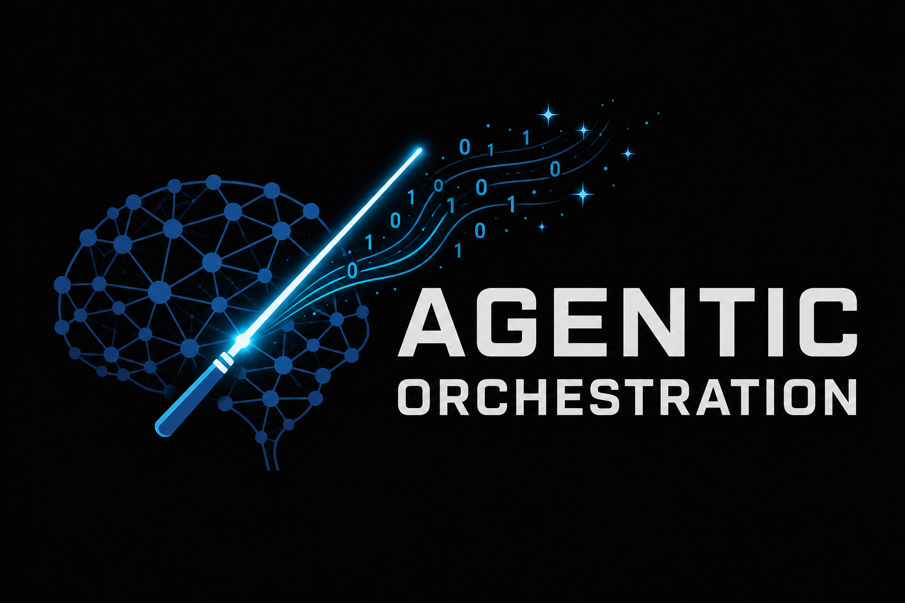

# Agentic Orchestration

[](https://github.com/zlatko-lakisic/agentic-orchestration/actions/workflows/ci.yml)

<p align="center">
  <a href="https://zlatko-lakisic.github.io/agentic-orchestration/">
    
  </a>
</p>

**A model-agnostic, agent-based orchestration engine** built on **[CrewAI](https://github.com/crewAIInc/crewAI)**.

Most AI systems are good at narrow tasks. This project asks a different question: can you get closer to general task processing not by making one model smarter, but by modeling the *process* a capable person uses— a coordinator that replans based on what was just tried, a working record of phases and steps, knowledge that should carry from one task to the next, and an impartial step that scores the outcome before it is considered done? That loop is the thesis; the code here is an experiment in building it.

The model-agnostic catalog system exists so the loop is not locked to any one vendor's model being "the smart one." The same orchestrator can mix **Ollama** (local), **OpenAI-compatible** APIs, **Anthropic Claude**, **Hugging Face**, and TPU endpoint providers (**vLLM**, **JetStream**)—picked per task from YAML catalogs, filtered by credentials and hardware (`cpu`/`gpu`/`tpu`, plus optional VRAM heuristics). A LiteLLM-backed planner can use the same breadth of backends for planning as for execution. Catalogs, MCP integrations, and pluggable execution backends are the engineering substrate, not the headline.

---

## What this repository is for

| You want… | Start here |
|-----------|------------|
| **Production-style orchestration** (YAML workflows, dynamic planning, MCP, sessions, learning, KB) | [`agentic-orchestration-tool/`](agentic-orchestration-tool/) |
| **Browser chat** over local WebSockets (dynamic & iterative modes, prose answers) | [`agentic-orchestration-web/`](agentic-orchestration-web/) |
| **Kubernetes / edge deploy** (coordinator, warm pool, delegation, Jetson k3s) | [`agentic-orchestration-tool/deploy/k8s/README.md`](agentic-orchestration-tool/deploy/k8s/README.md) |
| **Industry / scenario overlays** (extra orchestrator context, agent YAML, MCP catalog fragments; spans tool + web) | [`examples/verticals/`](examples/verticals/) |

**Deeper documentation (per package):**

- **[`agentic-orchestration-tool/README.md`](agentic-orchestration-tool/README.md)** — workflows, router, dynamic mode, agent provider lifecycle, extra providers, VRAM, MCP catalog, learning loop, knowledge base.
- **[`agentic-orchestration-web/README.md`](agentic-orchestration-web/README.md)** — Web UI setup, `AGENTIC_*` server env, security notes.
- **[`examples/verticals/README.md`](examples/verticals/README.md)** — how vertical overlays relate to the tool and web packages.

---

## Example verticals (domain overlays)

Verticals live under **[`examples/verticals/`](examples/verticals/)** at the **monorepo root** (sibling of `agentic-orchestration-tool/` and `agentic-orchestration-web/`). Each one bundles orchestrator context, optional extra agent-provider YAML, optional MCP YAML, and sometimes **web start/stop scripts** tuned for that scenario (separate default port so they can run next to the stock UI).

| Vertical | `main.py` flag | Web shortcut | README |
|----------|----------------|--------------|--------|
| **Healthcare** (medtech / evidence / commercial brief pitch) | `--example healthcare` | `npm run start:healthcare` (from [`agentic-orchestration-web/`](agentic-orchestration-web/)) | [`examples/verticals/healthcare/README.md`](examples/verticals/healthcare/README.md) |
| **Logistics** (warehousing: WMS / ERP MCP hooks + simulated fixtures + labor framing) | `--example logistics` | `npm run start:logistics` | [`examples/verticals/logistics/README.md`](examples/verticals/logistics/README.md) |

**CLI (from `agentic-orchestration-tool/`):** e.g. `python main.py --example healthcare --dynamic "…"` or `python main.py --example logistics --dynamic "…"` — no manual path merging into `.env` for the overlay paths.

**Maintainers — keep both indexes in sync:** when you add `examples/verticals/<id>/`, extend the table **above** and the **discovery table** in [`examples/verticals/README.md`](examples/verticals/README.md) with the stable `--example <id>` name, default example web port (if any), any `npm run start:<id>` or per-vertical script names, and a link to that folder’s `README.md`. Wire the example id in [`agentic-orchestration-tool/orchestration/example_overlays.py`](agentic-orchestration-tool/orchestration/example_overlays.py) and [`agentic-orchestration-tool/main.py`](agentic-orchestration-tool/main.py) (`--example` choices), and in the web server if you add a matching npm script or argv hook in [`agentic-orchestration-web/server.mjs`](agentic-orchestration-web/server.mjs) / [`agentic-orchestration-web/package.json`](agentic-orchestration-web/package.json).

---

## Vision: orchestration, not a single chatbot


This stack is an **orchestration layer**, not a replacement for any one LLM. The shipped components map onto a four-part process loop the project is testing:

1. **Coordinator that reevaluates** (`Planner`) — Interprets the goal and session history, then emits or revises a structured plan: steps, agent provider IDs, optional MCP and skill IDs. **Initial planning is only half of it:** `--dynamic-iterative` runs one step per round and re-plans after each result; the auto-controller can stop early or suggest a refined goal. That mid-run reevaluation—not "plan once, execute"—is the core behavior.
2. **Execution with steps as a working record** (`Runner` + `Tools`) — Builds a CrewAI `Crew` per step, resolves MCP configs and agent skills, and executes sequentially (or as configured). Prior step output flows into the next task (`AGENTIC_STEP_CONTEXT_INJECT`). With **`AGENTIC_EXECUTION_BACKEND=kubernetes`**, each workflow **step** runs in a worker pod; the coordinator only plans and dispatches. **Tools (MCP)** attach when relevant so agents call real APIs instead of inventing facts.
3. **Reevaluation mid-run** (`Adaptation`) — Iterative dynamic mode is where the loop closes inside a single goal: what was attempted and what happened feeds the next planner turn. Step output, controller signals, and optional per-round streaming keep the coordinator working from a live record, not a frozen plan.
4. **Knowledge transfer across tasks** (`Memory & aggregation`) — **Partial today.** Sessions persist planner turns and crew excerpts; an optional local **knowledge base** (SQLite + FTS) stores finalized outputs for retrieval in future plans; an optional **learning** loop scores runs and nudges provider choice. That is closer to caching and weighted hints than genuine "what I learned in task A changed my approach to task B." Do not read this as solved cross-task transfer yet.

**Impartial QA / outcome scoring** — **Fragmented today, not one unified step.** Three separate mechanisms exist: the learning-loop eval (`AGENTIC_LEARNING_EVAL`), platform harness L3 capability scoring (`--harness-tier capability`), and user-harness rubric scoring (`--harness-dir`). Each scores something useful; none is yet a single impartial QA gate before a deliverable is considered done. Unifying them is a natural next direction.

Configuration drives the substrate: YAML catalogs for agents, MCPs, skills, and workflows, plus environment variables for credentials and toggles. Teams can plug in fine-tuned or self-hosted models, in-house **MCP** servers, and existing API keys, then blend those with commodity cloud agents when that is faster or good enough. **Swap models and providers without rewriting orchestration logic**—only catalogs and env vars change.

---

## Who this is for

This repo is **well-suited for** teams that want to test or build on a **process-driven** approach to multi-step work—not a single chat model—without being locked to one LLM vendor:

- **Mixed-model environments** — bring fine-tuned, self-hosted, or proprietary models alongside commodity APIs (OpenAI, Anthropic, Ollama, Hugging Face). The coordinator loop and YAML catalogs stay the same; only which provider runs each step changes.
- **Regulated or audit-heavy settings** — government, defense, and financial services often need (a) procurement-friendly LLM agnosticism, (b) sovereign or air-gapped deployment via the **Kubernetes** execution backend (`AGENTIC_EXECUTION_BACKEND=kubernetes`), and (c) execution audit trails, session history, and human checkpoints that matter as much as raw model capability. In financial services especially, traceability and approval gates often outweigh which model is picked.

That substantiates the **production-style orchestration** row in the table above: YAML workflows, iterative replanning, MCP, sessions, learning, and KB—not a claim of existing production case studies or a finished AGI loop. If you only need a single-model chat UI, a thinner tool may suffice; if you want to experiment with coordinator-driven task processing as configuration, start with [`agentic-orchestration-tool/`](agentic-orchestration-tool/).

---

## Repository layout

```
agentic-orchestration/
├── agentic-orchestration-tool/  # Python orchestration engine (main entry: main.py)
│   ├── config/
│   │   ├── workflows/           # Static workflow YAML
│   │   ├── agent_providers/    # One YAML per agent “template” (dynamic catalog)
│   │   ├── mcp_providers/      # MCP server catalog (refs, streamable_http, env substitution)
│   │   ├── agent_skills/        # Procedural skill catalog (release_process, pr_review, etc.)
│   │   └── agent_harnesses/     # Platform-owned catalog verification profiles (L0–L3 tiers)
│   ├── deploy/k8s/             # Coordinator, warm pool, delegation broker, run-store PVC
│   ├── docker/                 # Coordinator + worker images
│   ├── orchestration/          # Runner, dynamic planner, sessions, learning, KB, K8s backends
│   │   └── backends/           # Pluggable execution: inprocess (default) / subprocess / kubernetes
│   └── main.py
├── agentic-orchestration-web/  # Node WebSocket UI (spawns Python tool)
│   ├── server.mjs
│   ├── public/
│   ├── start-web.ps1 / .sh      # Foreground + auto-restart
│   └── start-web-bg.ps1 / .sh   # Background (detached) starters
├── examples/
│   └── verticals/               # Domain overlays (tool + web); see README in that folder
│       ├── healthcare/        # orchestrator context + extra catalogs + harness packs + web scripts
│       └── logistics/         # warehousing: ERP/WMS MCP templates + simulated MCP + web scripts
└── (optional helper scripts at root)
```

**Gitignored runtime data** (local only):

- `__orchestrator_sessions__/` — planner history + crew excerpts per session
- `__orchestrator_learning__/` — traces, stats, pending web ratings
- `__orchestrator_kb__/` — knowledge base SQLite
- `__output__/` — extracted artifacts from runs
- `.env` files — never commit secrets

---

## Prerequisites

- **Python 3.12** recommended for the tool.
- **Node.js 18+** and **npm** for the web UI.
- At least one configured backend: **OpenAI API key**, **Anthropic** key, **HF token**, and/or **Ollama** running locally—depending on which agent providers you enable in YAML.

---

## Quick start

### 1) Orchestration tool (CLI)

```powershell
cd agentic-orchestration-tool
py -3.12 -m venv .venv
.\.venv\Scripts\Activate.ps1
python -m pip install --upgrade pip
pip install -r requirements.txt
copy .env.example .env
# Edit .env with your keys and optional AGENTIC_* toggles

$env:PYTHONUTF8 = 1
python main.py --dynamic "Your goal in natural language"
```

See **[`agentic-orchestration-tool/README.md`](agentic-orchestration-tool/README.md)** for `--dynamic-iterative`, `--orchestrator-session`, router mode, and workflow YAML.

### 2) Web UI

```powershell
cd agentic-orchestration-web
npm install
npm start
```

Open **http://127.0.0.1:3847/** by default. For LAN access, set `AGENTIC_WEB_HOST=0.0.0.0` in **`agentic-orchestration-web/.env`**.  

**Background run (no terminal left open):**

- Windows: `.\start-web-bg.ps1` — stop with `.\stop-web-bg.ps1`
- Linux/macOS: `./start-web-bg.sh` — stop with `./stop-web-bg.sh`  

Host/port are read from `AGENTIC_WEB_HOST` / `AGENTIC_WEB_PORT` in that folder’s `.env` unless you override on the command line.

**Security:** the web server runs local Python with user-supplied text. Do not expose it to the internet without authentication and hardening. Details: **[`agentic-orchestration-web/README.md`](agentic-orchestration-web/README.md)**.

Chat answers are **prose by default** (not raw JSON): the web server sets `AGENTIC_WEB_PROSE_DELIVERABLE=1` for orchestrator runs, and the UI unwraps any JSON-shaped agent output before rendering.

Behind **Warpgate** or another reverse proxy, configure session and user headers (`X-Agentic-Session-Id`, `X-Warpgate-Session-Id`, `X-Agentic-User-Name`). The UI uses a single WebSocket with keepalive for edge stability; host CPU/RAM metrics stream on that socket instead of HTTP polling.

### 3) Kubernetes (local kind or edge device)

Run the full stack in-cluster: **coordinator** (web UI), **warm pool** workers, **delegation broker**, shared **run-store** PVC, and optional MCP gateways.

**Local kind (Windows):**

```powershell
cd agentic-orchestration-tool
powershell -File scripts/k8s-apply-full-stack.ps1
kubectl port-forward -n agentic-orchestration svc/agentic-coordinator 3847:3847
# Open http://127.0.0.1:3847
```

**Jetson / single-node k3s** — pull from GitHub on the device, then:

```bash
bash agentic-orchestration-tool/scripts/jetson-deploy.sh
# Web UI via NodePort 30487 (Traefik/Warpgate upstream)
```

Set `AGENTIC_EXECUTION_BACKEND=kubernetes` and `AGENTIC_RUN_STORE_PATH` on the coordinator (see **`agentic-orchestration-tool/.env.example`**). Manifests, logging, and ops notes: **[`agentic-orchestration-tool/deploy/k8s/README.md`](agentic-orchestration-tool/deploy/k8s/README.md)**.

**How work maps to pods:** one **workflow step** → one worker execution (warm-pool pod reuse or a one-shot Job). Crew agents for that step run **in-process** inside the worker—not one pod per agent. Watch activity with `kubectl get pods,jobs -n agentic-orchestration -w` and `kubectl logs -f -l app.kubernetes.io/name=agentic-coordinator`.

---

## Environment variables

Configuration is **environment-first**: copy **`agentic-orchestration-tool/.env.example`** to **`agentic-orchestration-tool/.env`** and adjust. The example file is the **authoritative checklist** of variables (with comments).

### Summary by category

| Area | Examples (see `.env.example` for full list) |
|------|-----------------------------------------------|
| **OpenAI / compatible** | `OPENAI_API_KEY`, `OPENAI_BASE_URL`, `OPENAI_MODEL_NAME` |
| **Anthropic** | `ANTHROPIC_API_KEY`, `ANTHROPIC_BASE_URL` |
| **Hugging Face** | `HF_TOKEN`, `HUGGINGFACE_API_BASE` |
| **Ollama** | `OLLAMA_HOST`, `ROUTER_OLLAMA_MODEL` |
| **Dynamic planner** | `AGENTIC_PLANNER_MODEL` (e.g. `openai/...`, `anthropic/...`, `ollama/...`), `AGENTIC_PLANNER_USE_LITELLM`, `AGENTIC_PLANNER_MAX_STEPS`, `AGENTIC_PLANNER_JSON_MODE`, `AGENTIC_PLANNER_REPAIR_RETRY`, `AGENTIC_PLANNER_429_RETRIES`, `AGENTIC_PLANNER_CONTEXT_TURNS`, `AGENTIC_PLANNER_MESSAGE_CHARS` |
| **Sessions** | `AGENTIC_ORCHESTRATOR_SESSION`, `AGENTIC_ORCHESTRATOR_DEFAULT_SESSION`, `AGENTIC_ORCHESTRATOR_MAX_PLANNER_TURNS`, `AGENTIC_ORCHESTRATOR_EXCERPT_CHARS`, … |
| **Hardware** | `AGENTIC_AVAILABLE_ARCHITECTURES`, `AGENTIC_ASSUME_GPU`, `AGENTIC_ASSUME_TPU`, `AGENTIC_ASSUME_VRAM_GB`, `AGENTIC_MAX_VRAM_FRACTION`, `AGENTIC_MAX_VRAM_GB`, `AGENTIC_DISABLE_HARDWARE_FILTER`, … |
| **MCP / catalog** | `AGENTIC_EXTRA_MCP_PROVIDERS_PATH`, `HOME_ASSISTANT_URL`, `HOME_ASSISTANT_TOKEN`, search keys as documented in example |
| **Progress / UX** | `AGENTIC_PROGRESS`, `AGENTIC_STEP_CONTEXT_INJECT`, `AGENTIC_STEP_CONTEXT_CHARS` |
| **Learning & KB** | `AGENTIC_LEARNING`, `AGENTIC_LEARNING_EVAL`, `AGENTIC_EVAL_MODEL`, `AGENTIC_KB`, `AGENTIC_KB_MAX_HITS`, … |
| **Answer cache** | `AGENTIC_ANSWER_CACHE` |
| **Iterative mode** | `AGENTIC_DYNAMIC_ITERATIVE_*`, `AGENTIC_ITERATIVE_CONTROLLER_*` (and CLI flags) |
| **Execution backends** | `AGENTIC_EXECUTION_BACKEND` (`inprocess`, `subprocess`, `kubernetes`), `AGENTIC_SUBPROCESS_WORKERS`, `AGENTIC_K8S_*`, warm pool, delegation |
| **Web server** | `AGENTIC_WEB_HOST`, `AGENTIC_WEB_PORT`, `AGENTIC_TOOL_ROOT`, `AGENTIC_PYTHON`, `AGENTIC_WEB_PROSE_DELIVERABLE` — in **`agentic-orchestration-web/.env`** |

## Key features (orchestration tool)

- **CrewAI-native** — Agents, tasks, crews, sequential/hierarchical process.
- **Model-agnostic catalogs** — `config/agent_providers/*.yaml` with `type: ollama | openai | anthropic | huggingface | vllm | jetstream`.
- **Hardware-aware routing** — catalog entries can declare `hardware.architecture` (`cpu`/`gpu`/`tpu`) and incompatible providers are filtered out before planning.
- **Dynamic planning** — Natural-language goals → JSON plan → ephemeral workflow.
- **Per-task MCP** — MCP sets per step; agent instances deduplicated by provider + MCP fingerprint.
- **MCP catalog** — YAML entries with credential gating and goal-based suggestions/pruning.
- **Sessions** — Multi-turn planner memory + excerpts on disk.
- **Iterative dynamic** — One step per round, optional auto-controller and synthesis.
- **Learning loop** — Structured eval + optional user ratings → stats fed back into planner context.
- **Knowledge base** — SQLite FTS of past outputs for planner retrieval.
- **Answer cache** — Repeat exact question in-session → instant replay + “reply no to re-run”.
- **Execution backends** — `inprocess` (default), `subprocess` (per-step workers on laptop), `kubernetes` (coordinator + warm pool / Jobs on a cluster).
- **Kubernetes stack** — Coordinator Deployment, warm pool, delegation broker, run-store PVC, structured JSON logs, kind e2e in CI, Jetson deploy script.
- **Web chat UX** — Markdown rendering, verbose crew mode, prose-first answers (no JSON blobs in the UI).
- **Platform agent harness** — Tiered per-catalog verification (`--harness-agent`, `--harness-batch`); L0/L1 in CI; profiles in `config/agent_harnesses/`.
- **User agent harnesses** — Domain scenario packs (`--harness-dir`, `--user-harness-run-all`); healthcare example under `examples/verticals/healthcare/harnesses/`.

## TPU capabilities

- **TPU architecture support** — providers can declare `hardware.architecture: [tpu]` (or mixed sets like `[cpu, gpu]`).
- **Automatic detection** — runtime capability detection includes `cpu` by default, `gpu` via NVIDIA tooling, and `tpu` via TPU runtime markers.
- **Manual overrides** — set `AGENTIC_AVAILABLE_ARCHITECTURES`, `AGENTIC_ASSUME_GPU`, and `AGENTIC_ASSUME_TPU` when auto-detection is not enough.
- **TPU frameworks in catalog** — built-in provider types include `vllm` and `jetstream` for OpenAI-compatible TPU-serving endpoints.

---

## Scripts reference (web)

| Script | Purpose |
|--------|---------|
| [`agentic-orchestration-web/start-web.ps1`](agentic-orchestration-web/start-web.ps1) | Foreground npm with auto-restart |
| [`agentic-orchestration-web/start-web-bg.ps1`](agentic-orchestration-web/start-web-bg.ps1) | Windows: detached server |
| [`agentic-orchestration-web/stop-web-bg.ps1`](agentic-orchestration-web/stop-web-bg.ps1) | Windows: stop detached server |
| [`agentic-orchestration-web/start-web.sh`](agentic-orchestration-web/start-web.sh) | Linux: foreground + auto-restart |
| [`agentic-orchestration-web/start-web-bg.sh`](agentic-orchestration-web/start-web-bg.sh) | Linux: detached (`nohup`) |
| [`agentic-orchestration-web/stop-web-bg.sh`](agentic-orchestration-web/stop-web-bg.sh) | Linux: stop detached server |

**Per-vertical web scripts** (alternate port, PID beside the example, not under `agentic-orchestration-web/`): see each folder under [`examples/verticals/`](examples/verticals/) — e.g. [`healthcare/start-web.sh`](examples/verticals/healthcare/start-web.sh) or [`logistics/start-web.sh`](examples/verticals/logistics/start-web.sh) and matching `start-web-bg.*` / `stop-web.*`.

---

## Contributing & license

Treat this repo as a **personal / team experimentation** codebase unless you add an explicit license file. When publishing, ensure **no secrets** in Git (`.env`, API keys, session JSON, KB DB).

## Releases

Version **semver** (`VERSION`), notes in **`CHANGELOG.md`**, process in **`RELEASING.md`**. Push tag `vX.Y.Z` to publish a [GitHub Release](https://github.com/zlatko-lakisic/agentic-orchestration/releases). Say **“create a new release”** in Cursor to run the guided workflow (major / minor bump).

---

## Further reading

- **Product site** — [Agentic Orchestration](https://zlatko-lakisic.github.io/agentic-orchestration/) (features, getting started, and [documentation index](https://zlatko-lakisic.github.io/agentic-orchestration/documentation/)); technical pages sync from [`agentic-orchestration.wiki`](https://github.com/zlatko-lakisic/agentic-orchestration.wiki).
- **[awesome-mcp-servers](https://github.com/punkpeye/awesome-mcp-servers)** — community directory of MCP servers; **`MCP-providers.md`** maps shipped catalog `id`s (search, HA, memory, filesystem, fetch, Exa, …) to related listings and notes official vs community hosts.
- **[CrewAI documentation](https://docs.crewai.com/)** — core concepts for crews, agents, and tasks.
- **[Model Context Protocol](https://modelcontextprotocol.io/)** — how MCP tools integrate with agents.

For everything specific to YAML shape, CLI flags, and internal modules, start with **[`agentic-orchestration-tool/README.md`](agentic-orchestration-tool/README.md)**. For packaged **scenario overlays**, see **[`examples/verticals/README.md`](examples/verticals/README.md)** and the **Example verticals** section earlier in this file.
