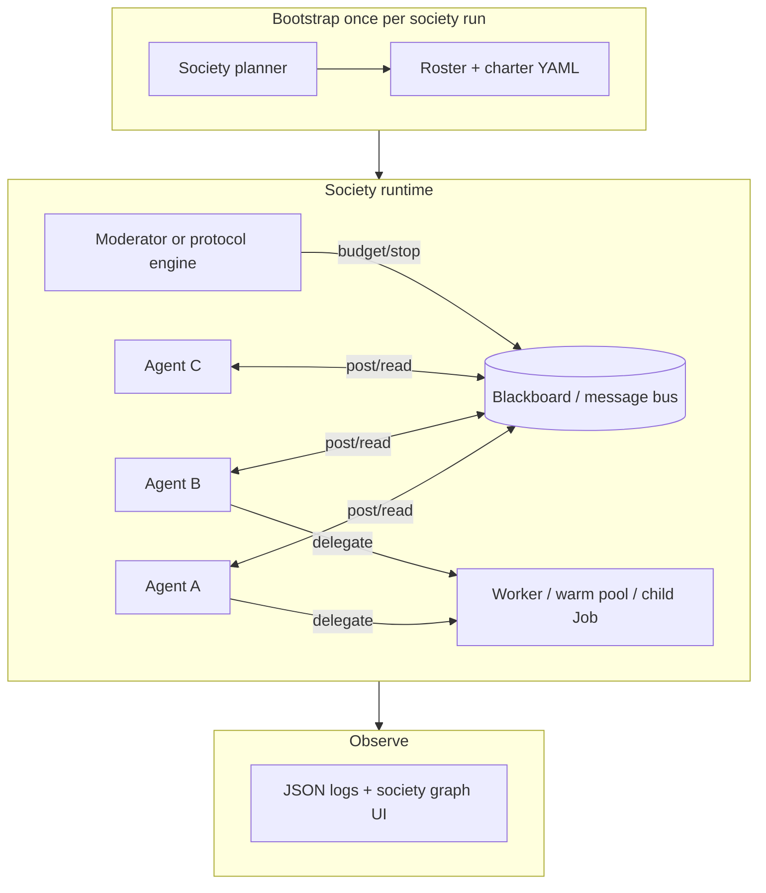

# Agent societies roadmap (K6)

Living document for evolving **Agentic Orchestration** from **orchestrated pipelines** (planner → sequential steps → injected prior output) toward **autonomous agent societies**: multiple agents that can initiate work, message each other, and delegate without the planner rewriting the full plan every turn.

**Status:** **In progress — Phase 0 + K6.1 (society lite) shipped** (2026-07). Phase 2 (blackboard message bus) is next; Phases 3–5 are design only.

**Shipped so far:** charter schema + [ADR 0001]({{ '/adr/0001-agent-societies-v1/' | relative_url }}), `python main.py --society CHARTER.yaml --goal "…"`, round-robin turn runtime with an append-only blackboard, society sessions under `__orchestrator_sessions__/societies/`, in-process `delegate_task` with a hard delegation budget, society controller, catalog flag `society_capable`, vertical example `examples/verticals/society_research_panel/`, and a `process: hierarchical` reference workflow.

**Builds on:** [Kubernetes execution upgrade]({{ '/kubernetes-execution-upgrade/' | relative_url }}) (K3–K5 complete: coordinator, warm pool, delegation RPC, structured logging), [Dual execution framework]({{ '/dual-execution-framework/' | relative_url }}), [Dynamic planning]({{ '/dynamic-planning/' | relative_url }}), [Sessions learning and knowledge base]({{ '/sessions-learning-kb/' | relative_url }})

**Related:** [Architecture]({{ '/architecture/' | relative_url }}), [Web UI]({{ '/web-ui/' | relative_url }}), [Configuration]({{ '/configuration/' | relative_url }}), [Agent provider catalog]({{ '/agent-catalog/' | relative_url }})

---

## What “agent society” means in this product

A **society** is not “one big group chat.” It is:

- **Multiple agents** with distinct roles and `agent_provider_id` values from the catalog
- **Autonomous initiation** — agents can message, delegate, or spawn work without the planner emitting a new linear plan each turn
- **Shared memory** — blackboard, threads, or session artifacts other members can read
- **Governed interaction** — budgets, permissions, audit, and stop conditions

### What exists today (coordination, not society)

| Pattern | Behavior |
|---------|----------|
| **Planner → steps** | Dynamic planner picks one agent per step; [Dynamic planning]({{ '/dynamic-planning/' | relative_url }}) |
| **Task handoff** | Prior step output injected into the next task/step description (`step_context.py`, `workflow_materializer.py`) |
| **K8s delegation** | `k8s_delegate_task` tool + delegation broker spawns child Jobs ([Kubernetes execution upgrade]({{ '/kubernetes-execution-upgrade/' | relative_url }}#phase-5--operational-polish-optional) K5.5) |
| **CrewAI delegation** | `allow_delegation: false` on virtually all catalog entries (`ollama_hermes3` is the facilitator exception) |
| **Hierarchical crews** | `process: hierarchical` supported in code; reference workflow shipped (`config/workflows/workflow_society_hierarchical_panel.yaml`) |
| **Society runtime (K6.1)** | `--society CHARTER.yaml` — round-robin turns, shared blackboard, bounded `delegate_task`, controller stop |

See [Kubernetes execution upgrade]({{ '/kubernetes-execution-upgrade/' | relative_url }}#non-goals-initial-phases) — in-run CrewAI delegation / hierarchical managers were explicitly deferred until a society use case justified them. **This page is that justification and roadmap.**

---

## Foundation already in the repo (do not rebuild)

| Building block | Use for societies |
|----------------|-------------------|
| Agent provider catalog | Society **members** registry |
| Dynamic planner | Society **bootstrap** (roster + charter once) — not every turn |
| Run-store PVC + JSON artifacts | Message bus / blackboard / delegation queue |
| `k8s_delegate_task` + delegation broker | Cross-agent work on K8s |
| Warm pool | Long-lived “resident” workers |
| Sessions + KB + learning | Society memory and reputation |
| Structured logging (`run_id`, `step_id`, `component`) | Society observability ([Kubernetes execution upgrade]({{ '/kubernetes-execution-upgrade/' | relative_url }}) LOGGING.md) |

---

## Target architecture (end state)



**Design principle:** societies need a **runtime protocol** (who speaks when, how messages route) **separate from the planner** (who is in the room and what the charter is).

**Recommended default stack (opinionated):**

1. **Bootstrap** — planner produces charter + roster once
2. **Runtime** — blackboard + protocol engine (Phase 2), not pure CrewAI delegation alone
3. **Execution** — `delegate_task` / `k8s_delegate_task` for heavy specialists; warm pool for fast back-and-forth
4. **Stop** — hard turn + token budgets always on

CrewAI `allow_delegation` and `hierarchical` are useful **Phase 1 shortcuts**; the durable model is **message bus + explicit tools** so laptop and K8s behave the same.

---

## Interaction modes (charter enum)

| Mode | Description | v1 status |
|------|-------------|-----------|
| `handoff` | Current behavior — sequential steps, prior output injection | Existing behavior |
| `crew_delegation` | CrewAI `allow_delegation: true` on selected agents | Reference workflow only |
| `hierarchical` | Manager agent + worker agents (`process: hierarchical`) | Reference workflow only |
| `blackboard` | Posts to shared memory; agents read it each turn (append-only in v1, threaded in K6.2) | **Shipped (K6.1)** — charter default |
| `delegate_rpc` | Delegation tool — `delegate_task` inline, `k8s_delegate_task` on K8s | **Shipped (K6.1)** |

---

## Phased roadmap

### Phase 0 — Definition and guardrails — **shipped**

**Deliverables**

- [x] **Society charter schema** (YAML): `config/schemas/society_charter.schema.json` — `society.id`, members (`agent_provider_id`, `role`, `charge`, `can_delegate`, per-member MCP allowlist), `max_turns`, `max_delegations`, `min_turns`, `protocol`, `interaction_mode`, `tools`, and `stop_when` phrases
- [x] Interaction modes enum (table above) — `blackboard` and `delegate_rpc` drive the v1 runtime; `handoff`, `crew_delegation`, and `hierarchical` are declarative
- [x] ADR: [`docs/adr/0001-agent-societies-v1.md`]({{ '/adr/0001-agent-societies-v1/' | relative_url }}) — non-goals v1: no unbounded spend, no internet-facing societies without auth, no nested societies, no cross-tenant/external agents, no parallel turns

**Exit criteria met:** `examples/verticals/society_research_panel/society_research_panel.yaml` charter (plus a Jetson-sized variant) and the one-page ADR are in the repo.

**Deferred:** token/cost cap in currency terms (turn and delegation caps only in v1); `consensus` and `timeout` stop conditions (v1 ships phrase-based `stop_when` plus the controller).

---

### Phase 1 — Society lite on laptop (`inprocess`) — K6.1 — **shipped**

**Goal:** Prove multi-agent autonomy **without K8s complexity**.

| Task | Work | Status |
|------|------|--------|
| **1.1** | Reference workflow: hierarchical crew — manager (`allow_delegation: true`) + 2 workers; `process: hierarchical` documented | [x] `config/workflows/workflow_society_hierarchical_panel.yaml`; `manager_llm` from `AGENTIC_CREW_MANAGER_MODEL` |
| **1.2** | Catalog flag `society_capable: true`; default `allow_delegation` remains `false`; societies opt in per entry | [x] `AgentProviderConfig.society_capable`; tagged on `ollama_hermes3` (the only `allow_delegation: true` entry), `ollama_llama3_3`, `ollama_qwen2_5_coder`, `ollama_llama3_2_3b`, `gpt_research`, `gpt_write`, `claude_research` |
| **1.3** | In-process `delegate_task` tool — same API surface as `k8s_delegate_task`, inline child step | [x] `orchestration/delegate_task_tool.py`; identical `_run` signature; budget reserved before the child runs |
| **1.4** | Society session type under `__orchestrator_sessions__/societies/`: roster, turn counter, blackboard path | [x] `orchestration/society_session.py` — `meta.json`, `blackboard.md`, `transcript.jsonl` |
| **1.5** | Society controller — reuse iterative controller pattern: `society_controller_decision(done, reason, budget_remaining)` | [x] `orchestration/society_controller.py`; model precedence `AGENTIC_SOCIETY_CONTROLLER_MODEL` → `AGENTIC_ITERATIVE_CONTROLLER_MODEL` → `AGENTIC_PLANNER_MODEL` |

**CLI (shipped):** `python main.py --society charter.yaml --goal "…"` (plus `--society-session`, `--society-max-turns`, `--society-no-controller`; mutually exclusive with `--dynamic` / `--dynamic-iterative`).

**Turn protocol:** `round_robin` in `orchestration/society_runtime.py`. `protocol: hierarchical` is accepted as an alias that still takes round-robin turns — manager-driven delegation quality varies too much across local and cloud models to be the default runtime (see ADR 0001).

**Exit criteria:** 3-agent panel with `max_turns: 12`, one bounded delegation path, controller stops cleanly, transcript in the session. Verify with `scripts/smoke_society_lite.sh` (offline) or `AGENTIC_SMOKE_SOCIETY_LIVE=1 scripts/smoke_society_lite.sh` (real short run).

---

### Phase 2 — Blackboard and message protocol — K6.2

**Goal:** Agents communicate **without** only stuffing prior output into the next task description.

| Task | Work |
|------|------|
| **2.1** | Message schema: `society/messages/{msg_id}.json` — `from_agent`, `to_agent` \| `broadcast`, `thread_id`, `content`, `refs[]`, `ts` on run-store or session dir |
| **2.2** | CrewAI tools: `society_post`, `society_read_thread`, `society_list_agents` |
| **2.3** | Turn protocol engine (Python): `round_robin`, `moderator_picks`, `reactive` (pull unread) |
| **2.4** | Optional parallel lanes — two agents same round; merge/synthesis step |

**Exit criteria:** Research agent posts; critic replies in-thread; writer runs only after critic marks `ready_for_draft`.

---

### Phase 3 — K8s-native societies — K6.3

**Goal:** Same charter on Jetson / cluster.

| Task | Work |
|------|------|
| **3.1** | Generalize delegation-broker → **society-broker**: routes messages, spawns child Jobs, enforces budget; queue `/run/store/society/` |
| **3.2** | Optional warm-pool **resident** mode: pod holds one `agent_provider_id`, loops `society_poll` |
| **3.3** | Optional multi-agent per pod when charter `colocation: true`; else one agent per pod (current model) |
| **3.4** | Network policy doc: worker egress to LLM + MCP; broker run-store only |

**Exit criteria:** Same charter works on laptop and K8s; logs show `component=society-broker`.

---

### Phase 4 — Web UI and observability — K6.4

| Task | Work |
|------|------|
| **4.1** | Web mode: “Society” vs “Single assistant”; stream blackboard + per-agent lines |
| **4.2** | Graph view: who messaged / delegated to whom |
| **4.3** | Budget bar: turns remaining, stop button |

**Exit criteria:** User watches a live panel in [Web UI]({{ '/web-ui/' | relative_url }}) without verbose Crew logs.

---

### Phase 5 — Governance and learning — K6.5

| Task | Work |
|------|------|
| **5.1** | Delegation ACL in charter: agent A may delegate only to `[b, c]` |
| **5.2** | [Sessions learning and knowledge base]({{ '/sessions-learning-kb/' | relative_url }}) integration — rate societies; roster hints from reputation |
| **5.3** | Immutable audit transcript export |
| **5.4** | Optional external A2A interop adapter on society-broker (later) |

---

## Example v1 society charter (research panel) — shipped

Shipped at `examples/verticals/society_research_panel/society_research_panel.yaml` (same vertical
pattern as healthcare / logistics), validated against `config/schemas/society_charter.schema.json`.
Members are local Ollama entries so the panel runs without cloud keys:

```yaml
society:
  id: research_panel
  protocol: round_robin
  interaction_mode: blackboard
  max_turns: 12
  max_delegations: 2
  min_turns: 3
  members:
    - agent_provider_id: ollama_hermes3
      role: facilitator
      can_delegate: true
      charge: You chair this panel…
    - agent_provider_id: ollama_llama3_3
      role: domain_expert
    - agent_provider_id: ollama_qwen2_5_coder
      role: critic
  stop_when:
    - facilitator_posts: "FINAL_RECOMMENDATION"
  tools:
    - delegate_task     # society_post / society_read_thread arrive in K6.2
```

```bash
cd agentic-orchestration-tool
python main.py --example society_research_panel \
  --society ../examples/verticals/society_research_panel/society_research_panel.yaml \
  --goal "Should we run our RAG index on the edge device or in the cluster?"
```

`society_research_panel_jetson.yaml` in the same directory seats three overlay entries backed by
`llama3.2:3b` for single-small-model edge devices.

---

## Risks and mitigations

| Risk | Mitigation |
|------|------------|
| Runaway cost / infinite loops | Turn cap, token budget, wall-clock timeout, controller LLM |
| Agents talking past each other | Thread IDs + moderator protocol |
| K8s pod explosion | Delegate depth limit; warm pool reuse; max concurrent Jobs |
| Debugging difficulty | Society `run_id`, message IDs in every log line; UI graph |
| MCP abuse | Charter MCP allowlist per member |

---

## Relationship to K5 and deferred K8s non-goals

| K5 item | Society extension |
|---------|-------------------|
| K5.5 delegation RPC | Becomes one **delegate** path; generalize to `delegate_task` on all backends |
| Warm pool | **Resident agents** for low-latency society turns |
| Structured logging | Add `society_id`, `message_id`, `from_agent`, `to_agent` fields |

[Kubernetes execution upgrade]({{ '/kubernetes-execution-upgrade/' | relative_url }}) listed “In-run CrewAI delegation / hierarchical manager agents” as deferred — **implement via K6.1–K6.2**, not by bolting delegation onto every catalog entry by default.

---

## First implementation slice — done

1. [x] ADR + society charter JSON/YAML schema
2. [x] **K6.1.3** — in-process `delegate_task` (parallel API to `k8s_delegate_task`)
3. [x] One **hierarchical** reference workflow with `allow_delegation: true` on manager only
4. [ ] Link from [Home]({{ '/' | relative_url }}) and this page from [Kubernetes execution upgrade]({{ '/kubernetes-execution-upgrade/' | relative_url }}#phase-5--operational-polish-optional)

### Files shipped in K6.1

| Path | Role |
|------|------|
| `config/schemas/society_charter.schema.json` | Charter JSON Schema |
| `orchestration/society_charter.py` | Charter load/validate; dataclasses; catalog + `society_capable` checks |
| `orchestration/society_session.py` | Session dir, `meta.json`, blackboard, transcript, delegation budget |
| `orchestration/society_controller.py` | `society_controller_decision(...)` |
| `orchestration/delegate_task_tool.py` | `delegate_task` CrewAI tool + inline child run |
| `orchestration/society_runtime.py` | `run_society(...)` round-robin turn loop |
| `main.py` | `--society`, `--goal`, `--society-session`, `--society-max-turns`, `--society-no-controller` |
| `examples/verticals/society_research_panel/` | Charters, edge overlay seats, orchestrator context, README |
| `config/workflows/workflow_society_hierarchical_panel.yaml` | Hierarchical crew reference |
| `scripts/smoke_society_lite.sh` / `.py` | Offline smoke (+ optional live run) |
| `tests/test_society_*.py`, `tests/test_delegate_task_tool.py` | Unit coverage (no live LLM) |

### Next up (K6.2)

Message schema under `society/messages/`, `society_post` / `society_read_thread` /
`society_list_agents` tools, and `moderator_picks` / `reactive` turn protocols — replacing the
append-only markdown blackboard, whose context grows linearly with turn count.

---

## Integrating external agents (vs catalog agents)

Society members are **catalog agent providers**, not arbitrary foreign processes.

| What you have | How it fits today | Gap |
|---------------|-------------------|-----|
| Custom **model** on OpenAI-/Anthropic-/Ollama-compatible API | Add a YAML entry under `config/agent_providers/` (or an extra catalog dir), set `society_capable: true`, reference its `id` in the charter | None for society lite |
| External **agent runtime** (separate platform, its own tools/memory) | Not a drop-in member. Options: (1) re-describe the capability as a catalog agent + MCP tools; (2) expose it behind an OpenAI-compatible shim and catalog that; (3) wrap it as an MCP server and attach tools to a catalog agent | Native A2A / society-broker adapter is K6.5+ |
| OpenClaw / other orchestrators | Use the shared orchestrate HTTP bridge or MCP sync; they are **clients** of AO, not society seats | Do not put foreign session IDs in the charter roster |

**Blackboard and `delegate_task`:** both operate on **internal** members that resolve through `load_agent_providers_catalog_merged`. Delegation to an unknown `agent_provider_id` fails fast. Cross-tenant or internet-facing societies without auth remain non-goals (ADR 0001).

**Enterprise pitch (honest):** AO is an orchestration layer over catalogs, APIs, and MCP — not a binary that hosts third-party agent runtimes unchanged. Bring models and tools into the catalog; do not expect foreign agent processes to join a panel without an adapter.

- [x] Section above shipped with K6.1 docs polish (2026-07-29)

---

## Open questions

1. **Society planner vs static charter only** — always LLM-bootstrap roster, or YAML-only for regulated tenants?
2. **Single society per session vs nested societies** — can a delegation child spawn its own mini-society?
3. **Human-in-the-loop** — when can a user inject a message mid-society (web UI)?
4. **Consensus semantics** — voting, moderator override, or LLM-judged “done”?
5. **Cost attribution** — per-member billing for enterprise dashboards?

---

## Revision log

| Date | Change |
|------|--------|
| 2026-06-29 | Initial K6 roadmap — agent societies plan (wiki page) |
| 2026-06-29 | Deferred doc: **Integrating external agents (vs catalog agents)** — add after K6 ships |
| 2026-07-29 | **Phase 0 + K6.1 shipped** — charter schema, ADR 0001, `--society` CLI, round-robin runtime, society sessions, bounded `delegate_task`, society controller, `society_capable` catalog flag, research-panel vertical, hierarchical reference workflow, society smoke |
| 2026-07-29 | Docs: **Integrating external agents (vs catalog agents)** section added |
