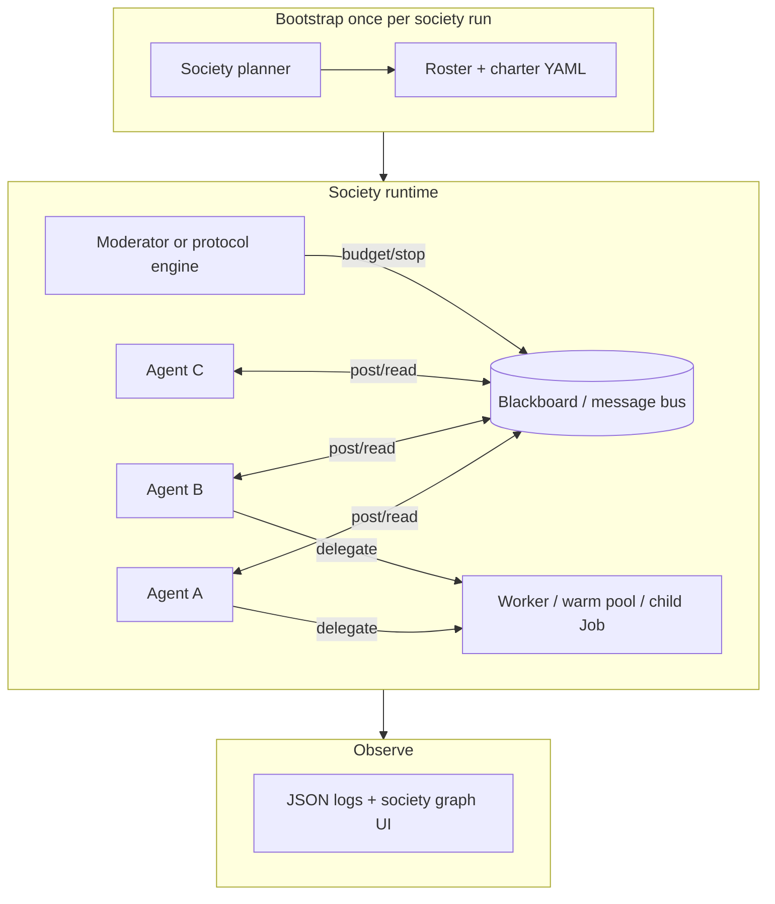

# Agent societies roadmap (K6)

Living document for evolving **Agentic Orchestration** from **orchestrated pipelines** (planner → sequential steps → injected prior output) toward **autonomous agent societies**: multiple agents that can initiate work, message each other, and delegate without the planner rewriting the full plan every turn.

**Status:** **Not started** — design and phased plan only (2026-06).

**Builds on:** [Kubernetes execution upgrade]({{ '/kubernetes-execution-upgrade/' | relative_url }}) (K3–K5 complete: coordinator, warm pool, delegation RPC, structured logging), [Dual execution framework]({{ '/dual-execution-framework/' | relative_url }}), [Dynamic planning]({{ '/dynamic-planning/' | relative_url }}), [Sessions learning and knowledge base]({{ '/sessions-learning-kb/' | relative_url }})

**Related:** [Architecture]({{ '/architecture/' | relative_url }}), [Web UI]({{ '/web-ui/' | relative_url }}), [Configuration]({{ '/configuration/' | relative_url }}), [Agent provider catalog]({{ '/agent-catalog/' | relative_url }})

---

## What “agent society” means in this product

A **society** is not “one big group chat.” It is:

- **Multiple agents** with distinct roles and `agent_provider_id` values from the catalog
- **Autonomous initiation** — agents can message, delegate, or spawn work without the planner emitting a new linear plan each turn
- **Shared memory** — blackboard, threads, or session artifacts other members can read
- **Governed interaction** — budgets, permissions, audit, and stop conditions

### What exists today (coordination, not society)

| Pattern | Behavior |
|---------|----------|
| **Planner → steps** | Dynamic planner picks one agent per step; [Dynamic planning]({{ '/dynamic-planning/' | relative_url }}) |
| **Task handoff** | Prior step output injected into the next task/step description (`step_context.py`, `workflow_materializer.py`) |
| **K8s delegation** | `k8s_delegate_task` tool + delegation broker spawns child Jobs ([Kubernetes execution upgrade]({{ '/kubernetes-execution-upgrade/' | relative_url }}#phase-5--operational-polish-optional) K5.5) |
| **CrewAI delegation** | `allow_delegation: false` on virtually all catalog entries |
| **Hierarchical crews** | `process: hierarchical` supported in code; no shipped reference workflow |

See [Kubernetes execution upgrade]({{ '/kubernetes-execution-upgrade/' | relative_url }}#non-goals-initial-phases) — in-run CrewAI delegation / hierarchical managers were explicitly deferred until a society use case justified them. **This page is that justification and roadmap.**

---

## Foundation already in the repo (do not rebuild)

| Building block | Use for societies |
|----------------|-------------------|
| Agent provider catalog | Society **members** registry |
| Dynamic planner | Society **bootstrap** (roster + charter once) — not every turn |
| Run-store PVC + JSON artifacts | Message bus / blackboard / delegation queue |
| `k8s_delegate_task` + delegation broker | Cross-agent work on K8s |
| Warm pool | Long-lived “resident” workers |
| Sessions + KB + learning | Society memory and reputation |
| Structured logging (`run_id`, `step_id`, `component`) | Society observability ([Kubernetes execution upgrade]({{ '/kubernetes-execution-upgrade/' | relative_url }}) LOGGING.md) |

---

## Target architecture (end state)



**Design principle:** societies need a **runtime protocol** (who speaks when, how messages route) **separate from the planner** (who is in the room and what the charter is).

**Recommended default stack (opinionated):**

1. **Bootstrap** — planner produces charter + roster once
2. **Runtime** — blackboard + protocol engine (Phase 2), not pure CrewAI delegation alone
3. **Execution** — `delegate_task` / `k8s_delegate_task` for heavy specialists; warm pool for fast back-and-forth
4. **Stop** — hard turn + token budgets always on

CrewAI `allow_delegation` and `hierarchical` are useful **Phase 1 shortcuts**; the durable model is **message bus + explicit tools** so laptop and K8s behave the same.

---

## Interaction modes (charter enum)

| Mode | Description |
|------|-------------|
| `handoff` | Current behavior — sequential steps, prior output injection |
| `crew_delegation` | CrewAI `allow_delegation: true` on selected agents |
| `hierarchical` | Manager agent + worker agents (`process: hierarchical`) |
| `blackboard` | Async posts to shared bus; agents pull threads |
| `delegate_rpc` | Existing K8s delegation tool (generalize to all backends in K6.1) |

---

## Phased roadmap

### Phase 0 — Definition and guardrails (design only)

**Deliverables**

- **Society charter schema** (YAML): `society_id`, members (`agent_provider_id`), roles, `max_turns`, `max_delegations`, token/cost cap, allowed MCPs, stop conditions (`consensus`, `moderator_done`, `timeout`)
- Interaction modes enum (table above)
- ADR: non-goals v1 — no unbounded spend, no internet-facing societies without auth

**Exit criteria:** Example `society_research_panel.yaml` charter + one-page ADR in repo `docs/` or wiki.

---

### Phase 1 — Society lite on laptop (`inprocess`) — K6.1

**Goal:** Prove multi-agent autonomy **without K8s complexity**.

| Task | Work |
|------|------|
| **1.1** | Reference workflow: hierarchical crew — manager (`allow_delegation: true`) + 2–3 workers; document `process: hierarchical` |
| **1.2** | Catalog flag `society_capable: true`; default `allow_delegation` remains `false`; societies opt in per entry |
| **1.3** | In-process `delegate_task` tool — same API surface as `k8s_delegate_task`, inline child step via `execute_step` |
| **1.4** | Society session type under `__orchestrator_sessions__/societies/`: roster, turn counter, blackboard path |
| **1.5** | Society controller — reuse iterative controller pattern: `society_controller_decision(done, reason, budget_remaining)` |

**CLI (proposed):** `python main.py --society charter.yaml --goal "…"`

**Exit criteria:** 3-agent panel, 10+ turns, one delegation, controller stops cleanly, transcript in session.

---

### Phase 2 — Blackboard and message protocol — K6.2

**Goal:** Agents communicate **without** only stuffing prior output into the next task description.

| Task | Work |
|------|------|
| **2.1** | Message schema: `society/messages/{msg_id}.json` — `from_agent`, `to_agent` \| `broadcast`, `thread_id`, `content`, `refs[]`, `ts` on run-store or session dir |
| **2.2** | CrewAI tools: `society_post`, `society_read_thread`, `society_list_agents` |
| **2.3** | Turn protocol engine (Python): `round_robin`, `moderator_picks`, `reactive` (pull unread) |
| **2.4** | Optional parallel lanes — two agents same round; merge/synthesis step |

**Exit criteria:** Research agent posts; critic replies in-thread; writer runs only after critic marks `ready_for_draft`.

---

### Phase 3 — K8s-native societies — K6.3

**Goal:** Same charter on Jetson / cluster.

| Task | Work |
|------|------|
| **3.1** | Generalize delegation-broker → **society-broker**: routes messages, spawns child Jobs, enforces budget; queue `/run/store/society/` |
| **3.2** | Optional warm-pool **resident** mode: pod holds one `agent_provider_id`, loops `society_poll` |
| **3.3** | Optional multi-agent per pod when charter `colocation: true`; else one agent per pod (current model) |
| **3.4** | Network policy doc: worker egress to LLM + MCP; broker run-store only |

**Exit criteria:** Same charter works on laptop and K8s; logs show `component=society-broker`.

---

### Phase 4 — Web UI and observability — K6.4

| Task | Work |
|------|------|
| **4.1** | Web mode: “Society” vs “Single assistant”; stream blackboard + per-agent lines |
| **4.2** | Graph view: who messaged / delegated to whom |
| **4.3** | Budget bar: turns remaining, stop button |

**Exit criteria:** User watches a live panel in [Web UI]({{ '/web-ui/' | relative_url }}) without verbose Crew logs.

---

### Phase 5 — Governance and learning — K6.5

| Task | Work |
|------|------|
| **5.1** | Delegation ACL in charter: agent A may delegate only to `[b, c]` |
| **5.2** | [Sessions learning and knowledge base]({{ '/sessions-learning-kb/' | relative_url }}) integration — rate societies; roster hints from reputation |
| **5.3** | Immutable audit transcript export |
| **5.4** | Optional external A2A interop adapter on society-broker (later) |

---

## Example v1 society charter (research panel)

```yaml
society:
  id: research_panel
  protocol: round_robin
  max_turns: 12
  members:
    - agent_provider_id: openai_gpt4o_mini
      role: facilitator
      can_delegate: true
    - agent_provider_id: acme_internal_llm   # hypothetical custom endpoint
      role: domain_expert
    - agent_provider_id: anthropic_claude_haiku
      role: critic
  stop_when:
    - facilitator_posts: "FINAL_RECOMMENDATION"
  tools:
    - society_post
    - society_read_thread
    - delegate_task
```

Ship as vertical example: `examples/verticals/society_research_panel/` (same pattern as healthcare / logistics).

---

## Risks and mitigations

| Risk | Mitigation |
|------|------------|
| Runaway cost / infinite loops | Turn cap, token budget, wall-clock timeout, controller LLM |
| Agents talking past each other | Thread IDs + moderator protocol |
| K8s pod explosion | Delegate depth limit; warm pool reuse; max concurrent Jobs |
| Debugging difficulty | Society `run_id`, message IDs in every log line; UI graph |
| MCP abuse | Charter MCP allowlist per member |

---

## Relationship to K5 and deferred K8s non-goals

| K5 item | Society extension |
|---------|-------------------|
| K5.5 delegation RPC | Becomes one **delegate** path; generalize to `delegate_task` on all backends |
| Warm pool | **Resident agents** for low-latency society turns |
| Structured logging | Add `society_id`, `message_id`, `from_agent`, `to_agent` fields |

[Kubernetes execution upgrade]({{ '/kubernetes-execution-upgrade/' | relative_url }}) listed “In-run CrewAI delegation / hierarchical manager agents” as deferred — **implement via K6.1–K6.2**, not by bolting delegation onto every catalog entry by default.

---

## Suggested first implementation slice

If green-lit, start with:

1. ADR + society charter JSON/YAML schema
2. **K6.1.3** — in-process `delegate_task` (parallel API to `k8s_delegate_task`)
3. One **hierarchical** reference workflow with `allow_delegation: true` on manager only
4. Link from [Home]({{ '/' | relative_url }}) and this page from [Kubernetes execution upgrade]({{ '/kubernetes-execution-upgrade/' | relative_url }}#phase-5--operational-polish-optional)

---

## Documentation follow-ups (after K6 implementation)

- [ ] Add section **Integrating external agents (vs catalog agents)** — clarify:
  - Custom **model** on a compatible API (catalog entry) vs external **agent runtime** (separate platform)
  - What is seamless today (re-describe in catalog) vs what needs an adapter (OpenAI shim, MCP-as-tool, future A2A on society-broker)
  - How K6 blackboard/delegation relates to **internal** society members only unless an adapter is built
  - Honest enterprise pitch: orchestration layer + APIs/MCP, not drop-in foreign agent binaries

---

## Open questions

1. **Society planner vs static charter only** — always LLM-bootstrap roster, or YAML-only for regulated tenants?
2. **Single society per session vs nested societies** — can a delegation child spawn its own mini-society?
3. **Human-in-the-loop** — when can a user inject a message mid-society (web UI)?
4. **Consensus semantics** — voting, moderator override, or LLM-judged “done”?
5. **Cost attribution** — per-member billing for enterprise dashboards?

---

## Revision log

| Date | Change |
|------|--------|
| 2026-06-29 | Initial K6 roadmap — agent societies plan (wiki page) |
| 2026-06-29 | Deferred doc: **Integrating external agents (vs catalog agents)** — add after K6 ships |
