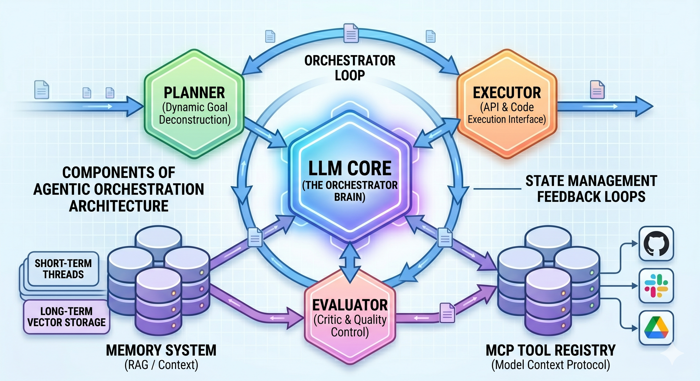

# Architecture

## High-level flow



1. **Planner** (dynamic modes) — Reads the user goal, session history, optional KB snippets, and learning summary; outputs a JSON plan: ordered steps with `agent_provider_id` and optional MCP ids.
2. **Catalog resolution** — Agent templates load from `config/agent_providers/` (or extra paths). MCP templates load from `config/mcp_providers/` plus `AGENTIC_EXTRA_MCP_PROVIDERS_PATH`. Entries without required credentials are filtered out before planning.
3. **Runner** — Selects execution backend (`AGENTIC_EXECUTION_BACKEND`, default in-process CrewAI). Builds CrewAI `Agent` / `Task` / `Crew` for in-process runs; distributed backends materialize `StepSpec` lists and coordinate per-step workers.
4. **Post-run** — Optional artifact extraction, verification, session JSON updates, learning traces, KB append, web UI progress.

## Packages

| Package | Role |
|---------|------|
| `agentic-orchestration-tool` | Python: YAML workflows, dynamic planner, MCP catalog, sessions, learning, KB, CLI (`main.py`). |
| `agentic-orchestration-web` | Node: HTTP + WebSocket server; spawns the tool for chat messages. |

## Configuration directories (tool)

```
agentic-orchestration-tool/config/
├── workflows/           # Static workflow YAML; routable files add top-level `meta`
├── agent_providers/    # One YAML per agent template (dynamic catalog)
└── mcp_providers/      # One YAML per MCP template (streamable HTTP, stdio, refs, env gates)
```

## Orchestration modules (selected)

Under `agentic-orchestration-tool/orchestration/`:

- `backends/` — Pluggable execution (`crewai`, `subprocess`, `kubernetes` stub); factory reads `AGENTIC_EXECUTION_BACKEND`.
- `workflow_materializer.py` — `WorkflowConfig` → `StepSpec` for distributed backends.
- `step_coordinator.py` — Sequential step loop shared by subprocess/K8s backends.
- `run_store.py` — Filesystem `{run_id}/{step_id}/result.json` handoff.
- `execute_step.py` — Worker entrypoint for `--execute-step`.
- `runner.py` — Build workflow, crew lifecycle (in-process path).
- `dynamic_planner.py` — Planning, iterative rounds, controller, synthesis, eval hooks.
- `mcp_providers_catalog.py` — Load/merge MCP YAML, env substitution, credential filtering, planner hints; resolves `streamable_http` and `stdio` blocks into CrewAI MCP configs.
- `orchestrator_session.py` — Session JSON under `__orchestrator_sessions__/`.
- `learning_store.py` — Traces, stats, pending ratings under `__orchestrator_learning__/`.
- `knowledge_base.py` — SQLite FTS under `__orchestrator_kb__/`.
- `catalog_loader.py` / `config_loader.py` — Workflow and provider discovery.

## Gitignored runtime paths

| Path | Content |
|------|---------|
| `__orchestrator_sessions__/` | Planner turns + excerpts per session slug. |
| `__orchestrator_learning__/` | `stats.json`, `traces.jsonl`, `pending_ratings.jsonl`. |
| `__orchestrator_kb__/` | `kb.sqlite3` (FTS index). |
| `__output__/` | Extracted artifacts from runs. |
| `.env` | Secrets — never commit. |

## Extension points

- **More agents:** add YAML under `config/agent_providers/` or `AGENTIC_EXTRA_AGENT_PROVIDERS_PATH` (Python provider classes).
- **More MCPs:** add YAML under `config/mcp_providers/` or `AGENTIC_EXTRA_MCP_PROVIDERS_PATH`. Discover third-party servers via [awesome-mcp-servers](https://github.com/punkpeye/awesome-mcp-servers) (see [MCP providers](MCP-providers/) for shipped examples).
- **Custom workflows:** add files under `config/workflows/`; optional `meta` for router inclusion.

See also: [Agent provider catalog](Agent-provider-catalog/), [MCP providers](MCP-providers/), [Configuration](Configuration/), [Infrastructure](Infrastructure/) (Docker Compose, Ollama sidecar, volumes), [Dual execution framework](Dual-execution-framework/) (pluggable execution backends — F0–F3 shipped), [Kubernetes execution upgrade](Kubernetes-execution-upgrade/) (cluster delivery — K3+ pending).
