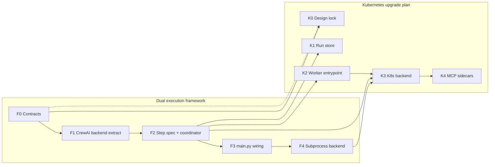
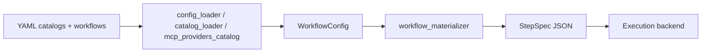
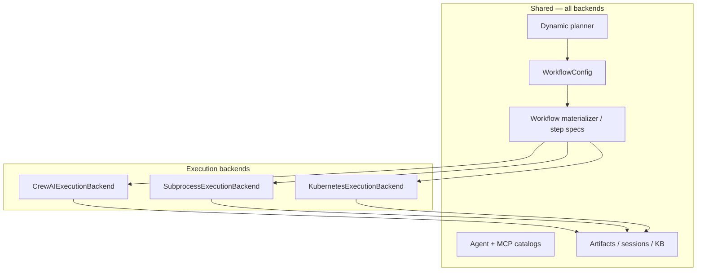

# Dual execution framework roadmap

Living document for refactoring **Agentic Orchestration** so workflow **execution** is pluggable: **CrewAI in-process** remains the default, with optional backends for **subprocess workers** and **Kubernetes Jobs**.

**Status:** **F0–F5 MVP implemented** (in-process default). Subprocess: `AGENTIC_SUBPROCESS_WORKERS=1`. Kubernetes: `AGENTIC_EXECUTION_BACKEND=kubernetes` + K8s env vars (cluster e2e manual).

**Companion plan:** [Kubernetes execution upgrade](Kubernetes-execution-upgrade/) — distributed workers, cluster manifests, MCP sidecars, and K8s-specific ops. This page owns the **code seam**; the K8s page owns **cluster delivery**.

**Related:** [Architecture](Architecture/), [Dynamic planning](Dynamic-planning/), [Configuration](Configuration/), [Kubernetes execution upgrade](Kubernetes-execution-upgrade/)

---

## How the two plans relate

| Topic | This plan (dual framework) | [Kubernetes execution upgrade](Kubernetes-execution-upgrade/) |
|-------|---------------------------|----------------------------------|
| **Scope** | Python refactor: interfaces, backends, `main.py` wiring | Pods, Jobs, PVCs, sidecars, cluster testing |
| **Default path** | `CrewAIExecutionBackend` — identical to today | Not required for local dev |
| **Shared contracts** | `ExecutionBackend`, `StepSpec`, `StepResult` | Consumes those contracts; defines worker CLI + K8s manifests |
| **Ship value without K8s** | ✅ Yes (F0–F4 complete) | ❌ Cluster phases only |
| **Prerequisite order** | **F0–F4 complete** ✅ | K0.6 + K2.3 worker image, then K3 (F5) |



**Rule:** Finish **F0–F3** before implementing `KubernetesExecutionBackend` (K8s Phase 3). **F4** (subprocess) is recommended before K8s but not strictly required.

---

## Goals

| Goal | Notes |
|------|--------|
| **Two orchestration frameworks** | CrewAI in-process (default) + pluggable remote backends |
| **No regression** | `AGENTIC_EXECUTION_BACKEND=inprocess` preserves current behavior |
| **Clear seam** | Planning, catalogs, sessions, artifacts stay backend-agnostic |
| **CrewAI stays the agent runtime** | Both backends use CrewAI inside the execution unit (whole crew in-process; mini-Crew per worker remotely) |
| **Incremental** | First PR can be extract-only with zero behavior change |
| **Shared YAML catalogs** | Agent, MCP, and workflow YAML formats unchanged — one config surface for all backends |

## Non-goals (initial phases)

- Replacing CrewAI as the agent/tool loop inside workers
- Abstracting `AgentProvider` away from CrewAI `Agent` (defer)
- Third orchestration engines (Argo, Temporal) — interface should allow later, not build now
- **New agent or MCP YAML schemas** for subprocess/K8s backends (see [Shared configuration](#shared-configuration-yaml-unchanged))
- Parallel catalog directories per execution backend

---

## Shared configuration (YAML unchanged)

**Principle:** All execution backends consume the **same** YAML catalogs and workflow shapes. The dual-framework refactor changes **how** steps run, not **how** agents and MCPs are defined.

### What stays identical (no backend-specific forks)

| Config | Location | Used by |
|--------|----------|---------|
| **Agent providers** | `config/agent_providers/*.yaml`, `AGENTIC_EXTRA_AGENT_PROVIDERS_PATH` | Planner, all backends |
| **MCP providers** | `config/mcp_providers/*.yaml`, `AGENTIC_EXTRA_MCP_PROVIDERS_PATH` | Planner, all backends |
| **Static workflows** | `config/workflows/*.yaml` | All backends |
| **Dynamic plan output** | Ephemeral `WorkflowConfig` (same fields as workflow YAML) | All backends |
| **Catalog loaders** | `catalog_loader.py`, `mcp_providers_catalog.py`, `config_loader.py` | Shared; not duplicated per backend |
| **Provider factory** | `agent_provider_from_dict()` → `AgentProvider` | In-process and worker pods |

Existing YAML fields (`id`, `type`, `role`, `goal`, `backstory`, `model`, `stdio` / `streamable_http` MCP blocks, `required_env`, `planner_hint`, etc.) remain authoritative. See [Agent provider catalog](Agent-provider-catalog/), [MCP providers](MCP-providers/), [Workflows and router](Workflows-and-router/).

### What is new (runtime only — not user-facing config)

| Artifact | Purpose | Replaces YAML? |
|----------|---------|----------------|
| **`StepSpec`** | Resolved, per-step payload passed to a worker or in-process executor | **No** — derived at runtime from `WorkflowConfig` + catalog resolution |
| **`StepResult`** | Per-step output written to run store | **No** |
| **`WorkflowExecutionResult`** | Final outcome for sessions/artifacts | **No** |

`StepSpec` embeds a **copy of the resolved agent provider dict** and **resolved MCP configs** (same structures `build_workflow()` uses today after `filter_entries_by_api_credentials` and `resolve_workflow_mcp_refs`). It is a transport format, not a second catalog format.

### Data flow (one YAML path, many backends)



Workers and coordinator **never** read alternate agent YAML layouts. Workers receive `StepSpec` (or rebuild from the same resolved dicts via shared Python loaders if spec points at catalog ids only — prefer **embedded resolved dict** in v1 to avoid drift).

### Backend-specific behavior without YAML forks

When a backend cannot support an MCP transport (e.g. stdio MCP on K8s without sidecar), handle via **runtime policy**, not new YAML:

| Situation | Approach | YAML change? |
|-----------|----------|--------------|
| Stdio MCP unavailable in K8s | Filter catalog at plan time (`AGENTIC_EXECUTION_BACKEND=kubernetes`) or env gates already on MCP YAML | **No** |
| Missing credentials | Existing `filter_entries_by_api_credentials` / `filter_mcp_entries_by_api_credentials` | **No** |
| GPU / resource limits for K8s | Optional **scheduling** fields added later must be **optional** and ignored by in-process backend | Only if added; in-process ignores |

If scheduling metadata is ever added to agent provider YAML (e.g. `min_vram_gb` already exists for hardware filtering), it must remain **optional** so CrewAI in-process and subprocess backends behave as today when unset.

### Implementation guardrails

- [x] **G1** No `config/agent_providers_k8s/` or duplicate MCP catalog trees.
- [x] **G2** `workflow_materializer` calls existing loaders/resolvers — no parallel YAML parsers.
- [x] **G3** Worker `--execute-step` uses `build_workflow()` + resolved MCP payloads from spec (`task_mcp_overrides`).
- [x] **G4** Regression tests: same workflow YAML resolves identically for `inprocess` and `subprocess` step specs (`step_specs_resolution_fingerprint`, materializer parity tests).
- [x] **G5** Wiki/catalog docs ([Agent provider catalog](Agent-provider-catalog/), [MCP providers](MCP-providers/)) stay single source of truth; backends do not get separate catalog pages.
- [x] **G6** New execution-backend behavior covered by [Testing and CI](Testing-and-CI/) markers (`backend_inprocess` + `backend_subprocess` shipped; `backend_kubernetes` deferred to F5).

---

## Two layers (do not conflate)

| Layer | CrewAI path | K8s path |
|-------|-------------|----------|
| **Orchestration** | One process, `crew.kickoff()` | Coordinator loop, Job per step |
| **Agent runtime** | CrewAI `Agent` + MCP | **Same** — mini-Crew in worker pod |

The dual-framework refactor is about the **orchestration layer**. Kubernetes is one orchestration backend, not a replacement for CrewAI as the LLM/MCP engine.

---

## Current architecture (after F0–F3)

```
WorkflowConfig
  → execution_backend_from_env()     # factory.py
  → CrewAIExecutionBackend           # default: build_workflow() + crew.kickoff()
  → SubprocessExecutionBackend       # optional: StepCoordinator + --execute-step workers
  → post-run                         # artifacts, sessions, learning (unchanged)
```

| Module | Role today |
|--------|------------|
| `orchestration/backends/crewai.py` | In-process kickoff (extracted from `main.py`) |
| `orchestration/backends/factory.py` | `AGENTIC_EXECUTION_BACKEND` selection |
| `orchestration/workflow_materializer.py` | `WorkflowConfig` → `list[StepSpec]` |
| `orchestration/step_coordinator.py` | Sequential step loop (subprocess/K8s) |
| `orchestration/run_store.py` | Filesystem `{run_id}/{step_id}/result.json` |
| `orchestration/execute_step.py` | Worker: one step from spec JSON |
| `orchestration/execution_dispatch.py` | Routes config → distributed `execute_config` or in-process `execute_built` (F4) |
| `orchestration/runner.py` | Still builds Crew + Agents + Tasks for in-process path |
| `main.py` `execute_workflow_from_config()` | CLI/static/dynamic entry → `execute_workflow_config_resolved` |

**Already framework-agnostic:** planner, catalogs, sessions, KB, learning, web UI spawn.

<details>
<summary>Previous coupling (pre-refactor)</summary>

```
WorkflowConfig
  → build_workflow()       # runner.py — builds Crew, Agents, Tasks
  → run_built_workflow()   # main.py — crew.kickoff(), retries, lifecycle
  → post-run               # artifacts, sessions, learning
```

| Module | Problem (resolved in F1–F3) |
|--------|----------------------------|
| `main.py` `run_built_workflow()` | Kickoff not swappable → now delegates to backend |
| `BuiltWorkflow` | CrewAI-shaped at API boundary → internal to `CrewAIExecutionBackend` only |

</details>

---

## Target architecture



### Backend selection

```
AGENTIC_EXECUTION_BACKEND=inprocess | subprocess | kubernetes
```

Default: `inprocess` → `CrewAIExecutionBackend`.

Factory: `orchestration/backends/factory.py` → `execution_backend_from_env()`.

---

## Proposed module layout

```
agentic-orchestration-tool/orchestration/
├── backends/
│   ├── __init__.py
│   ├── base.py              # ExecutionBackend protocol, RunOptions, WorkflowExecutionResult
│   ├── factory.py           # execution_backend_from_env()
│   ├── crewai.py            # CrewAIExecutionBackend (current kickoff path)
│   ├── subprocess.py        # SubprocessExecutionBackend
│   └── kubernetes.py        # KubernetesExecutionBackend (thin; details in K8s plan)
├── execution_dispatch.py    # execute_workflow_config_resolved (F4 CLI routing)
├── step_coordinator.py      # Sequential loop, inject prior output, shared lifecycle hooks
├── workflow_materializer.py # WorkflowConfig → list[StepSpec]; MCP resolution
├── run_store.py             # Abstract store + filesystem impl
├── runner.py                # Slim: build_workflow for CrewAI backend internal use (or moved into crewai.py)
└── ...                      # existing modules unchanged
```

`main.py` changes:

```python
options = run_options_from_legacy(...)
result = execute_workflow_config_resolved(config, options=options)
# subprocess + AGENTIC_SUBPROCESS_WORKERS=1 → backend.execute_config (StepCoordinator)
# otherwise → build_workflow + backend.execute_built
# existing post-run unchanged
```

---

## Core types (contracts)

Shared with [Kubernetes execution upgrade](Kubernetes-execution-upgrade/) — canonical JSON schemas live there; Python types mirror them.

### `StepSpec`

Backend-agnostic, serializable description of one planned step. Built by `workflow_materializer.build_step_specs(config)`.

**Not a new config format.** Fields are populated from existing `WorkflowConfig` + shared catalog resolution (same code path as `build_workflow()`). The `agent_provider` object in a step spec matches a resolved catalog entry dict; `mcp_providers[].resolved` matches `resolve_workflow_mcp_refs()` output.

Fields align with K8s plan [step spec JSON schema](Kubernetes-execution-upgrade/#step-spec-json-schema-draft-v01) for worker transport only.

### `StepResult`

One step outcome. Aligns with K8s plan [worker result contract](Kubernetes-execution-upgrade/#worker-result-contract-draft-v01).

### `WorkflowExecutionResult`

```python
@dataclass
class WorkflowExecutionResult:
    exit_code: int
    result_text: str | None
    error: BaseException | None
    step_results: list[StepResult] = field(default_factory=list)
```

Callers (`main.py`, sessions, artifacts) use this — never `BuiltWorkflow.crew`.

### `RunOptions`

```python
@dataclass
class RunOptions:
    quiet: bool = False
    emit_stdout_summary: bool = True
    emit_progress_lines: bool = True
    execution_error_sink: list[str] | None = None
    log_terminal_execution_failure: bool = True
    run_id: str = ""  # generated if empty
```

### `ExecutionBackend` protocol

```python
class ExecutionBackend(Protocol):
    def execute_built(
        self,
        built: BuiltWorkflow,
        *,
        options: RunOptions,
    ) -> WorkflowExecutionResult: ...

    def execute_config(
        self,
        config: WorkflowConfig,
        *,
        options: RunOptions,
    ) -> WorkflowExecutionResult: ...
```

Optional capability flag:

```python
@property
def supports_distributed_steps(self) -> bool: ...
```

---

## Backend implementations

### `CrewAIExecutionBackend` (default)

**Maps to:** current `build_workflow()` + `run_built_workflow()`.

| Aspect | Behavior |
|--------|----------|
| Execution unit | Whole `Crew` in one process |
| Step handoff | Existing `_serial_crew_task_callback` + inject |
| MCP stdio | Works as today |
| HF fallback | In-process rebuild + re-kickoff |
| Provider recovery | In-process retry |

**Phase F1** is extract-only — no behavior change.

### `SubprocessExecutionBackend`

**Maps to:** K8s plan Phase 2 bridge — no cluster required.

| Aspect | Behavior |
|--------|----------|
| Execution unit | `python main.py --execute-step spec.json` per step |
| Step handoff | `StepCoordinator` + filesystem run store |
| MCP stdio | Works in worker subprocess |
| HF fallback | Workflow-level via `main._run_dynamic_workflow_with_hf_fallback` | Per-step respawn deferred (K3.4 post-MVP) |

Proves the worker contract before K8s Phase 3.

### `KubernetesExecutionBackend`

**Maps to:** K8s plan Phase 3 — implementation details in [Kubernetes execution upgrade](Kubernetes-execution-upgrade/).

| Aspect | Behavior |
|--------|----------|
| Execution unit | K8s Job → worker pod per step (`kubernetes_runner.py`, mirrors `subprocess_runner.py`) |
| Step handoff | `StepCoordinator` + PVC-mounted `FileSystemRunStore` |
| MCP stdio | Sidecars / HTTP MCPs (K8s plan Phase 4) |
| HF fallback | Workflow-level via `main` for K3 MVP; per-step Job retry deferred |

This backend is a **thin adapter** over `StepCoordinator` + K8s client (same pattern as `subprocess_runner.py`); cluster manifests and worker image live in the K8s plan.

---

## Shared: `StepCoordinator`

Both distributed backends use the same sequential loop logic (extracted from `runner.py` callbacks):

```python
class StepCoordinator:
    def run_workflow(
        self,
        steps: list[StepSpec],
        *,
        execute_step: Callable[[StepSpec], StepResult],
        run_store: RunStore,
        run_options: RunOptions,
    ) -> WorkflowExecutionResult: ...
```

Responsibilities:

- Iterate `task_sequence`
- `prepare_step_description(step, prior_output)` — port of `_inject_previous_output_into_next_task`
- Call `AgentProvider.before_task` / `after_task` via provider instances
- Emit `(progress)` lines
- Invoke per-step `execution_fallback` / provider recovery — **deferred** (workflow-level retry in `main` today; see [Kubernetes execution upgrade](Kubernetes-execution-upgrade/#post-f4-plan-adjustments-2026-06))
- Write/read run store between steps

**CrewAI backend** may use `StepCoordinator` with an in-process `execute_step` closure, or keep whole-crew kickoff until F2 — see [phased roadmap](#phased-roadmap).

---

## What stays CrewAI-specific

| Component | CrewAI-only? | Notes |
|-----------|--------------|-------|
| `agent_providers/*` | Yes (for now) | Workers use same code |
| `crewai_mcp_hotfix.py` | Yes | Worker subprocess/pods |
| `BuiltWorkflow.crew` | Yes | Internal to `CrewAIExecutionBackend` only |
| Planner, catalogs, sessions | No | All backends |
| `WorkflowConfig` | No | All backends |
| `StepSpec` / `StepResult` | No | All backends — runtime transport, derived from YAML |
| Agent/MCP/workflow **YAML files** | No | **Unchanged** — see [Shared configuration](#shared-configuration-yaml-unchanged) |

---

## Phased roadmap

Track progress by checking boxes. Phases prefixed **F** belong to this plan only.

### Phase F0 — Contracts (no behavior change)

**Standalone:** ✅ Yes.

**Parallel with:** K8s Phase 0 (schema review — pair in one session).

- [x] **F0.1** Add `orchestration/backends/base.py` — `ExecutionBackend`, `RunOptions`, `WorkflowExecutionResult`, `StepSpec`, `StepResult` dataclasses.
- [x] **F0.2** Align field names with [step spec](Kubernetes-execution-upgrade/#step-spec-json-schema-draft-v01) and [result JSON](Kubernetes-execution-upgrade/#worker-result-contract-draft-v01) in K8s plan.
- [x] **F0.3** Add `execution_backend_from_env()` (returns `CrewAIExecutionBackend` by default; lazy-loads other backends).
- [x] **F0.4** Document `AGENTIC_EXECUTION_BACKEND` in [Configuration](Configuration/) and `.env.example`.

**Exit criteria:** Types merged; K8s plan schemas and Python types match. ✅

---

### Phase F1 — Extract `CrewAIExecutionBackend` (pure refactor)

**Standalone:** ✅ Yes — **recommended first implementation PR**.

**Depends on:** F0.

- [x] **F1.1** Move `run_built_workflow()` kickoff logic → `orchestration/backends/crewai.py`.
- [x] **F1.2** `CrewAIExecutionBackend.execute_built()` calls existing `build_workflow()` + kickoff path unchanged.
- [x] **F1.3** `main.py` calls backend via factory; behavior identical.
- [x] **F1.4** Regression: static workflows + `--dynamic` pass with `AGENTIC_EXECUTION_BACKEND=inprocess` (mocked tests in default CI + live LLM workflow opt-in).

**Exit criteria:** Zero user-visible change; all execution goes through `ExecutionBackend`. ✅ (default path)

---

### Phase F2 — Materializer + `StepCoordinator`

**Standalone:** ✅ Yes — enables step-based execution for all backends.

**Depends on:** F1.

**Parallel with:** K8s Phase 1 (run store).

- [x] **F2.1** Add `workflow_materializer.py` — `build_step_specs(config) -> list[StepSpec]` using **existing** catalog loaders and MCP resolvers (no new YAML schema).
- [x] **F2.2** Port prior-output inject → `prepare_step_description()` (`orchestration/step_context.py`).
- [x] **F2.3** Add `step_coordinator.py` — sequential loop, progress.
- [x] **F2.4** Add `run_store.py` — filesystem implementation.
- [x] **F2.5** **Decision:** keep whole-crew kickoff in `CrewAIExecutionBackend` until F4; distributed backends use `StepCoordinator` (see [Decision log](#decision-log)).
- [x] **F2.6** Unit tests: materializer, inject, coordinator loop (run store round-trip).
- [x] **F2.7** Guardrail **G4**: same workflow YAML resolves identically for distributed step specs (`tests/test_workflow_materializer.py`).

**Exit criteria:** Step specs produced from any `WorkflowConfig`; coordinator tested in isolation. ✅

---

### Phase F3 — `main.py` wiring + post-run adapter

**Standalone:** ✅ Yes.

**Depends on:** F1 (required); F2 (recommended).

- [x] **F3.1** Single entry: `backend.execute_built()` / `execute_config()` via factory.
- [x] **F3.2** HF fallback + provider recovery remain in `CrewAIExecutionBackend` (not duplicated in `main.py`).
- [x] **F3.3** `output_artifacts.py` accepts `WorkflowExecutionResult` / `StepResult` (`extractable_text_from_*`, `offer_save_extracted_files_from_execution`).
- [x] **F3.4** Session JSON records optional `last_execution_backend`; dynamic paths pass backend name on update.

**Exit criteria:** `main.py` has no direct `crew.kickoff()` calls; post-run pipeline backend-agnostic. ✅

---

### Phase F4 — `SubprocessExecutionBackend`

**Standalone:** ✅ Yes — no K8s.

**Depends on:** F2, F3.

**Parallel with:** K8s Phase 2 (worker entrypoint — coordinate on `--execute-step` CLI).

- [x] **F4.1** Implement `SubprocessExecutionBackend` using `StepCoordinator` + run store (`subprocess_runner.py`).
- [x] **F4.2** Spawn `python main.py --execute-step` (CLI + `execute_step.py` worker).
- [x] **F4.3** Integration test: 2-step workflow via subprocess backend locally (`tests/test_backend_subprocess.py`, mocked worker).
- [x] **F4.4** `AGENTIC_EXECUTION_BACKEND=subprocess` documented (`.env.example`, [Configuration](Configuration/)).
- [x] **F4.5** CLI/static/dynamic paths route through `execute_workflow_config_resolved` when subprocess workers enabled (`execution_dispatch.py`).

**Note:** Subprocess workers are **opt-in** via `AGENTIC_SUBPROCESS_WORKERS=1`. Without it, the subprocess backend falls back to in-process CrewAI (safe default). With workers enabled, normal CLI (`run_workflow`, `--dynamic`, etc.) uses distributed step execution — not only direct `execute_config` calls.

**Exit criteria:** Full dynamic run via subprocess without cluster; proves distributed contract. ✅

---

### Phase F5 — `KubernetesExecutionBackend` stub → full

**Standalone:** ❌ No — requires K8s plan Phases 2–3.

**Depends on:** F4 ✅; K8s plan Phases K2.3 + K3.

- [x] **F5.0** Extend `execution_dispatch.py` so `kubernetes` backend routes to `execute_config`.
- [x] **F5.2** Implement `kubernetes_runner.py` + `kubernetes_jobs.py` (Job spawn/wait/read).
- [ ] **F5.3** Feature parity matrix vs in-process — cluster e2e on kind (K3 MVP code ✅; live cluster pending).

**Exit criteria:** `AGENTIC_EXECUTION_BACKEND=kubernetes` runs on kind/minikube — **code complete**; cluster validation manual.

---

## Feature parity matrix (backends)

Track gaps when testing non-default backends.

| Capability | CrewAI in-process | Subprocess | Kubernetes |
|------------|-------------------|------------|------------|
| Static workflows | ✅ today | ✅ (workers opt-in) | ✅ mocked Jobs / kind manual |
| `--dynamic` | ✅ today | ✅ (workers opt-in) | ✅ mocked Jobs / kind manual |
| `--dynamic-iterative` | ✅ today | TBD | TBD |
| Stdio MCPs | ✅ | ✅ | K4 sidecars |
| HF execution fallback | ✅ workflow-level | ✅ workflow-level | ✅ workflow-level (K3 MVP) |
| Provider recovery | ✅ workflow-level | ✅ workflow-level | K3 MVP / per-step post-MVP |
| Web UI progress lines | ✅ today | ✅ | K3 |
| Session / KB / learning | ✅ today | ✅ | K3 |

---

## Testing strategy

| Phase | Tests |
|-------|--------|
| F0 | Type/import smoke | See [Testing and CI](Testing-and-CI/) |
| F1 | Full regression suite, `inprocess` only | CI unit + import jobs |
| F2 | Unit: materializer, coordinator, inject, run store | ✅ shipped |
| F3 | Integration: dynamic + static via factory | ✅ post-run adapters + dispatch |
| F4 | Subprocess 2-step e2e | ✅ `backend_subprocess` |
| F5 | kind/minikube (with K8s plan) | pending |

**Regression bar:** After every phase, `AGENTIC_EXECUTION_BACKEND=inprocess` must match pre-refactor behavior.

---

## Risks and mitigations

| Risk | Mitigation |
|------|------------|
| `BuiltWorkflow` leaks outside CrewAI backend | Callers only see `WorkflowExecutionResult` |
| Duplicated retry/fallback | Shared `StepCoordinator` + existing `execution_fallback.py` |
| F1 refactor breaks web UI spawn | Run web integration smoke after F1 |
| Two plans drift | Cross-link checkboxes; F0/K0 schema review together |
| Over-abstraction before K8s | Ship F1 extract-only before F2 |

---

## Decision log

| Date | Decision | Rationale |
|------|----------|-----------|
| 2025-06-26 | Dual plans: this page (framework seam) + [Kubernetes execution upgrade](Kubernetes-execution-upgrade/) (cluster) | Separate concerns; framework ships value without K8s |
| 2025-06-26 | CrewAI remains agent runtime in all backends | Minimize MCP/provider rewrite |
| 2025-06-26 | Default backend = `CrewAIExecutionBackend` / `inprocess` | No regression for dev and existing deploys |
| 2025-06-26 | F0–F3 before K8s Phase 3 | K8s backend plugs into seam, not a fork of `main.py` |
| 2025-06-26 | **YAML catalogs unchanged** — shared agent/MCP/workflow format for all backends | One config surface; `StepSpec` is runtime transport only |
| 2025-06-26 | F2: whole-crew vs mini-Crew per step in in-process backend | **Whole-crew until F4** — `CrewAIExecutionBackend` unchanged; distributed backends use `StepCoordinator` |
| 2026-06-26 | F0–F4 merged to `main` branch | Default `inprocess`; subprocess workers behind `AGENTIC_SUBPROCESS_WORKERS=1` |
| 2026-06-26 | K8s plan tightened post-F4 | PVC run store; `kubernetes_runner` mirrors subprocess; K3.0 dispatch gate; per-step retry deferred |

---

## Open questions

1. ~~**F2 timing:** Switch in-process backend to step-based mini-Crew in F2, or keep whole-crew kickoff until F4?~~ **Resolved:** whole-crew until F4.
2. **`BuiltWorkflow` fate:** Keep as internal type in `crewai.py` only, or deprecate name in favor of `StepSpec` list?
3. **Iterative dynamic mode:** Does coordinator replan require backend capability flag or separate code path in `main.py`?
4. **CLI flag vs env only:** Support `--execution-backend subprocess` for one-off runs?

---

## Suggested work order

**Completed:** F0 → F1 → F2 → F3 → F4 ✅

**Next (K8s / F5):** See [Kubernetes execution upgrade](Kubernetes-execution-upgrade/#suggested-work-order-current--post-f4) — K0.6 → K2.3 worker image → K3.0 dispatch → K3.1–3.8 kind test → K4 sidecars.

**Valid stopping points:** After F4 (distributed without K8s) ✅ **current stopping point**. After K3 (K8s with HTTP MCPs).

---

## Wiki maintenance

- [x] [Configuration](Configuration/) — `AGENTIC_EXECUTION_BACKEND`, `AGENTIC_SUBPROCESS_WORKERS`.
- [x] [CLI reference](CLI-reference/) — `--execute-step` worker flag.
- [x] [Testing and CI](Testing-and-CI/) — F2 unit tests checklist.
- [ ] [Architecture](Architecture/) — execution backend diagram (partial module list updated).
- [x] Cross-check [Kubernetes execution upgrade](Kubernetes-execution-upgrade/) phase checkboxes after F4 (wiki synced 2026-06).
