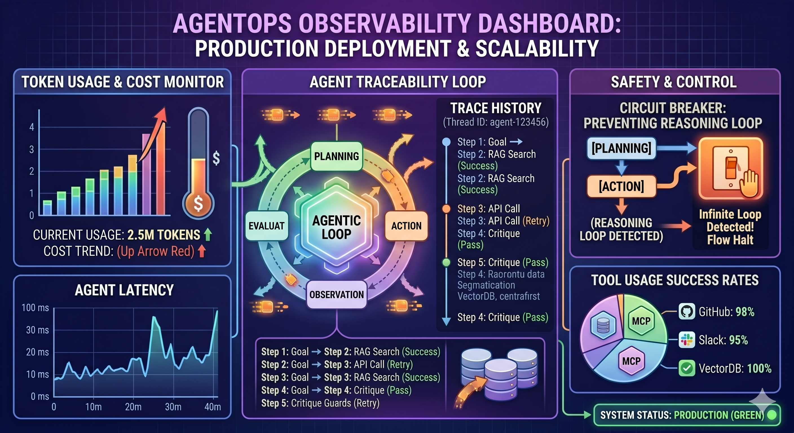

# Infrastructure

This page describes how **Agentic Orchestration** is deployed in production-style setups. For day-to-day local development, start with the root **`README.md`** and package READMEs (`agentic-orchestration-tool/`, `agentic-orchestration-web/`).



## Deployment modes

| Mode | Notes |
|------|--------|
| **Bare metal / VM** | Install Python 3.12+ and Node 18+; run the web UI with `npm start` and point `AGENTIC_TOOL_ROOT` at the folder that contains `main.py`. |
| **Docker Compose** | Multi-container stack at the monorepo root (see below). **Keep this section in sync** when you add, rename, or remove services in `docker-compose.yml`. |

## Docker Compose stack

When using containers, the repository defines a **`docker-compose.yml`** (or `compose.yaml`) at the **monorepo root**. The layout below reflects the **current** services.

### Services

| Service (Compose name) | Role | Typical image / build context | Ports (host → container) |
|------------------------|------|-------------------------------|----------------------------|
| **`orchestration`** | Runs the **web UI** and the **Python orchestration tool** together: Node serves HTTP/WebSocket and spawns `python main.py` against the mounted tool tree (`AGENTIC_TOOL_ROOT`). | Build from repo root or a multi-stage Dockerfile that includes `agentic-orchestration-web/` and `agentic-orchestration-tool/`. | **`3847`** → web listen port (`AGENTIC_WEB_PORT`). |
| **`ollama`** | Optional **local LLM** runtime used when workflows use Ollama-backed agent providers. | Official **`ollama/ollama`** image (or vendor-supported variant). | **`11434`** → Ollama API (only if you need host access; otherwise leave internal-only). |

**Networking:** From inside Compose, the tool and web should use service DNS names, e.g. set **`OLLAMA_HOST=http://ollama:11434`** for the orchestration container so pulls and chat hit the **same** Ollama process (see tool `.env` / [Configuration](Configuration/)).

**Volumes (persistence):**

- Mount a named or bind volume for **Ollama model blobs** if you do not want images re-pulled after every recreate (often mapped to the host path your distro uses, e.g. Linux `ollama` service under `/usr/share/ollama/.ollama`, or `OLLAMA_MODELS` as documented by Ollama).
- Mount host directories for **`__orchestrator_sessions__/`**, **`__orchestrator_kb__/`**, **`__orchestrator_learning__/`**, and **`__output__/`** if you need sessions, KB, and artifacts to survive container replacement (see [Architecture](Architecture/) — *Gitignored runtime paths*).

**Environment:** Combine variables from **`agentic-orchestration-web/.env`** and **`agentic-orchestration-tool/.env`** (or inject the same keys via Compose `environment:` / `env_file:`). Authoritative variable list: **`agentic-orchestration-tool/.env.example`** and [Configuration](Configuration/).

### Security

- The web stack **executes local Python** with user-supplied chat text. Do not expose **`AGENTIC_WEB_HOST`** to untrusted networks without authentication and hardening (see [Web UI](Web-UI/)).
- Restrict Ollama’s published port if only the orchestration container should call it.

## Kubernetes (planned)

Distributed step execution (pod-per-step, coordinator + worker Jobs) is documented in [Kubernetes execution upgrade](Kubernetes-execution-upgrade/). Framework F0–F4 and K8s Phases 0–2 (worker CLI, image) are implemented in code; cluster Jobs (K3) are next.

### Worker image (K8s Phase 2.3)

Build from `agentic-orchestration-tool/`:

```bash
docker build -f docker/Dockerfile.worker -t agentic-orchestrator-worker:local .
```

See `agentic-orchestration-tool/docker/README.worker.md` for mounts, secrets, and smoke script (`scripts/docker-worker-smoke.ps1`). Set `AGENTIC_K8S_WORKER_IMAGE` when K3 Job templates land.

Coordinator Deployment + Job manifests: K3.7 (not yet in repo).

## Related

- [Architecture](Architecture/) — packages, runtime directories
- [Configuration](Configuration/) — environment variables
- [Web UI](Web-UI/) — `AGENTIC_*` web server settings
- [Kubernetes execution upgrade](Kubernetes-execution-upgrade/) — K8s execution roadmap
- [Dual execution framework](Dual-execution-framework/) — pluggable execution backends
