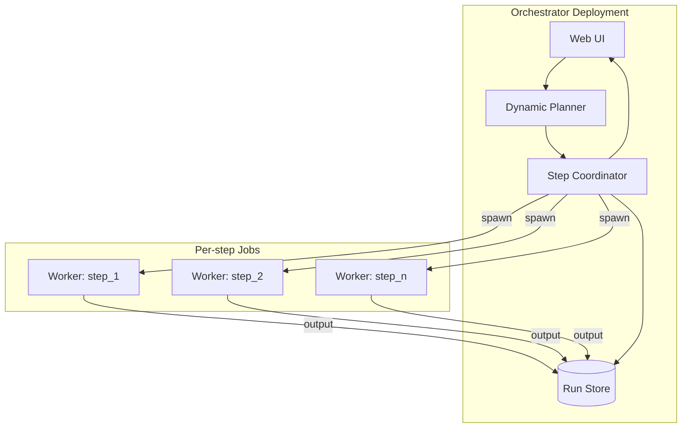
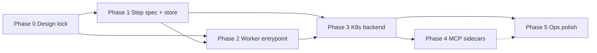
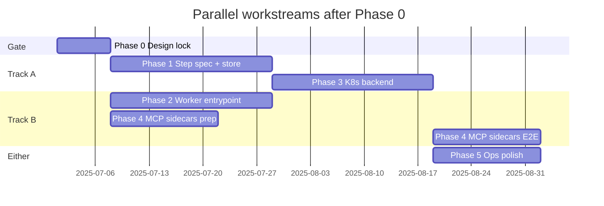

# Kubernetes execution upgrade roadmap

Living document for evolving **Agentic Orchestration** from in-process CrewAI `kickoff()` to optional **Kubernetes-backed step execution** (pod-per-step / pod-per-agent), while keeping the planner, catalogs, sessions, learning, and web UI.

**Status:** **K3 MVP + K4 implemented** (Job runner, kind CI e2e, MCP sidecars/gateways, planner filter). K5 unchanged.

**Companion plan:** [Dual execution framework](Dual-execution-framework/) — Python refactor for pluggable execution backends (`CrewAI` in-process default, `subprocess`, `kubernetes`). **This page owns cluster delivery; the companion page owns the code seam.** Framework **F0–F4** is complete; K8s Phase 3 implements framework **F5**.

**Related:** [Architecture](Architecture/), [Infrastructure](Infrastructure/), [Dynamic planning](Dynamic-planning/), [MCP providers](MCP-providers/), [Configuration](Configuration/), [Sessions learning and knowledge base](Sessions-learning-and-knowledge-base/), [Dual execution framework](Dual-execution-framework/)

---

## Relationship to the dual execution framework plan

Two separate roadmaps; one system.

| | [Dual execution framework](Dual-execution-framework/) | This page (K8s upgrade) |
|---|-------------------------------|-------------------------|
| **Delivers** | `ExecutionBackend`, `StepCoordinator`, backend factory, CrewAI extract | Worker image, Jobs, PVCs, sidecars, kind tests |
| **Required first** | F0–F4 complete ✅ | K0 sign-off + K2.3 worker image before K3 |
| **Value without cluster** | ✅ F4 = subprocess workers prove distributed contract | ❌ until Phase 3 |
| **Shared artifacts** | Python types | Step spec + result JSON schemas (canonical) |

See the companion plan for module layout (`orchestration/backends/`), `ExecutionBackend` protocol, and framework Phases F0–F5.

---

## Goals

| Goal | Notes |
|------|--------|
| **Optional K8s execution** | Local in-process mode remains the default for dev; K8s is opt-in. |
| **Preserve orchestration brain** | Planner, YAML catalogs, session/KB/learning, artifact pipeline stay central. |
| **Shared YAML config** | Agent, MCP, and workflow YAML unchanged across backends — [Dual execution framework](Dual-execution-framework/#shared-configuration-yaml-unchanged). |
| **Isolate agents per step** | Each planned step can run in its own pod with secrets, resources, and crash isolation. |
| **Minimize CrewAI loss** | Prefer **mini-Crew per pod** (1 agent, 1 task) so MCP tool loops and provider code reuse stay intact. |
| **Incremental delivery** | Each phase ships value; no big-bang rewrite. |

## Non-goals (initial phases)

- Replacing the dynamic planner with a K8s-native workflow engine (Argo, Temporal, etc.).
- In-run CrewAI delegation / hierarchical manager agents (not used today; defer unless needed).
- Multi-tenant hardening beyond what Compose/K8s secrets already imply.
- Forked or backend-specific agent/MCP/workflow YAML catalogs (runtime policy only; see [Dual execution framework](Dual-execution-framework/#shared-configuration-yaml-unchanged)).

---

## Terminology

| Term | Meaning in this doc |
|------|---------------------|
| **Coordinator** | Process that owns the step loop: spawn workers, hand off outputs, retries, sessions. Today this logic lives in `main.py` + `runner.py`. |
| **Worker** | Ephemeral pod/Job that executes **one** planned step and writes results to shared storage. |
| **Crew run** | One user goal → one plan → N sequential steps. Maps to a K8s **Job** graph or coordinator-managed Job chain, **not** a K8s Node. |
| **Run store** | PVC mounted at a shared path for v1; same `FileSystemRunStore` as local/subprocess (S3/Redis deferred) |

---

## Current vs target architecture

### Today (default + subprocess)

```
Web UI → spawn python main.py
         → execution_backend_from_env()
         → inprocess: build_workflow() → Crew.kickoff() in one process
         → subprocess (AGENTIC_SUBPROCESS_WORKERS=1): StepCoordinator → --execute-step workers
         → sessions / KB / artifacts
```

Key modules: `orchestration/execution_dispatch.py`, `orchestration/runner.py`, `orchestration/backends/subprocess_runner.py`, `orchestration/execute_step.py`, `orchestration/dynamic_planner.py`.

### Target (K8s mode)

```
Web UI → Coordinator (Deployment)
         → Planner → WorkflowConfig / step specs
         → for each step: K8s Job (worker pod)
         → run store (handoff prior output)
         → sessions / KB / artifacts (unchanged)
```



---

## What we keep vs change

| Component | Keep? | Change |
|-----------|-------|--------|
| Dynamic planner | ✅ | May filter MCP catalog in K8s mode |
| Agent provider YAML + factory | ✅ | Workers call same `build_agent()` |
| MCP catalog resolution | ✅ | Prefer HTTP MCPs; stdio → sidecar or cluster service |
| `runner.py` sequential inject logic | ✅ | Ported to `step_context.prepare_step_description` + `StepCoordinator` ✅ |
| `execution_fallback.py` | ✅ | Workflow-level HF fallback via `main._run_dynamic_workflow_with_hf_fallback`; per-step retry deferred (see Phase 3) |
| Session / learning / KB | ✅ | Add K8s run metadata to session JSON |
| `crew.kickoff()` whole crew | ❌ (K8s mode) | Replaced by coordinator step loop |
| Web spawn single process | ⚠️ | Coordinator still spawns or embeds tool; workers separate |

---

## Recommended execution strategy

**Option A — Mini-Crew per pod (recommended)**

Each worker runs a new CLI mode, e.g. `--execute-step`, that:

1. Loads one step spec (JSON).
2. Builds 1 `Agent`, 1 `Task`, 1 `Crew` (single task).
3. Calls `kickoff()`.
4. Writes `result.json` + artifacts to the run store.

**Option B — Custom agent loop (defer)**

Replace CrewAI in workers with LiteLLM + MCP SDK. Only consider if CrewAI coupling becomes painful.

---

## Losses and mitigations

Use this table when prioritizing work. Each row maps to phase tasks below.

| Loss | Mitigation | Primary phase |
|------|------------|---------------|
| In-memory step handoffs | Coordinator + run store; port `_inject_previous_output_into_next_task` | 1, 3 |
| Stdio MCP subprocesses | HTTP MCPs first; sidecars for fetch/filesystem; catalog filter in K8s mode | 3, 4 |
| HF → Ollama execution fallback | Workflow-level retry in `main` + **per-step** retry in distributed backends (`step_recovery.py`) | 3 ✅ |
| Provider recovery retry | Workflow-level in-process + **per-step** via `recovery_hint` in `StepCoordinator` | 3 ✅ |
| CrewAI MCP tool loop | Mini-Crew per pod (Option A) | 2 |
| LLM provider abstraction | Same `AgentProvider` code inside worker image | 2 |
| CrewOutput / artifacts | Worker `result.json` contract; thin adapter in coordinator | 1, 2 |
| Delegation / hierarchical | Don't replicate initially; planner already orchestrates | — |
| CrewAI ecosystem upgrades | Pin worker image; `ExecutionBackend` interface | 2, 5 |
| Step latency / cold start | Warm pool (optional); image pre-pull; slim worker image | 4, 5 |
| Cross-pod debuggability | `run_id`/`step_id` logging; session run record; Loki/ELK | 3 |

---

## Phase dependencies and parallelism

Phases are **not fully independent**. Some stand alone and ship value without later work; others are integration milestones that require earlier contracts. Use this section when scheduling work across sessions or contributors.

### Dependency graph



**Legend:** solid arrows = hard dependency; dotted = soft (Phase 5 benefits from Phase 4 but can start without it).

### Independence summary

| Phase | Standalone? | Depends on | Ships value without later phases? |
|-------|-------------|------------|-----------------------------------|
| **0 — Design lock** | ✅ Yes | Nothing | ✅ Yes — unblocks all other work |
| **1 — Step spec + store** | ⚠️ Mostly | **0** (schemas agreed) | ✅ Yes — cleaner in-process execution, same UX |
| **2 — Worker entrypoint** | ⚠️ Mostly | **0**; **1** strongly recommended | ✅ Yes — subprocess/container worker, no K8s |
| **3 — K8s backend** | ❌ No | **1 + 2** | ❌ No — needs spec, store, and worker |
| **4 — MCP sidecars** | ⚠️ Partially | **3** for end-to-end validation | ⚠️ Partial — manifests/docs yes; E2E proof needs K8s |
| **5 — Ops polish** | ⚠️ Partially | **3** for most items | ⚠️ Partial — image pinning/runbook can start early |

### What can run in parallel

After **Phase 0** is locked:

| Track A | Track B | Notes |
|---------|---------|-------|
| **Phase 1** (coordinator + run store, in-process) | **Phase 2** (worker CLI + Dockerfile) | Parallel **if** step spec JSON is frozen in Phase 0. Prefer **1 as lead** — it defines how specs are built; 2 consumes them. |
| Phase 4 **design/docs** (sidecar manifests, MCP matrix) | Phase 1 or 2 | Draft sidecars before K8s exists; cannot prove until Phase 3. |
| Phase 5 **CrewAI pin / worker image policy** | Phase 2 | Image tagging and upgrade runbook do not require a cluster. |

**Phase 3** should start when **K0 is signed off**, **subprocess demo works** (✅ F4), and **worker image** (K2.3) exists for Job pods.

Phases **4 and 5** are enhancements, not prerequisites for a minimal K8s demo (HTTP MCPs only).

### Independent workstreams (tracks)

Treat these as separate milestones you can stop after:

| Track | Phases | Outcome | Skip |
|-------|--------|---------|------|
| **Refactor only** | 0, 1 | `ExecutionBackend`, step specs, in-process loop — no containers, no K8s | 2–5 |
| **Worker isolation** | 0, 1, 2 | `--execute-step`, `SubprocessExecutionBackend`, subprocess integration tests | 3–5 ✅ **shipped via F4** |
| **Kubernetes (HTTP MCPs)** | 0, 1, 2, 3 | Full K8s sequential runs with streamable HTTP MCPs | 4 (initially), 5 |
| **K8s MCP parity** | 0–4 | Stdio MCPs via sidecars; planner catalog policy | 5 until needed |
| **Production hardening** | 5 (after 3) | Warm pool, centralized logging, load tests | — |

### Minimal paths by goal

| Goal | Phases required | Can skip |
|------|-----------------|----------|
| Better code structure only | 0, 1 | 2–5 |
| Containerized agents, no K8s | 0, 1, 2 | 3–5 | Subprocess path ✅; container image (2.3) still open |
| K8s with HTTP MCPs only | 0, 1, 2, 3 | 4 (initially), 5 |
| Full K8s parity with local MCPs | 0–4 | 5 until needed |

### Practical rules

1. **Phase 0 is the only true prerequisite for everything** — without frozen step/result schemas, Phases 1 and 2 will diverge.
2. **Phases 1 and 2 are loosely coupled** — parallelizable after 0, but Phase 1 should own spec generation; Phase 2 only consumes specs.
3. **Phase 3 is not independent** — it glues Phase 1 (coordinator + store) and Phase 2 (worker) onto a cluster.
4. **Phases 4 and 5 are optional depth** — not required for a first K8s demo.
5. **Each track can ship on its own** — stopping after Phase 1 or Phase 1+2 is valid; you do not need K8s to get value from this roadmap.

---

## Post-F4 plan adjustments (2026-06)

Framework **F4** (subprocess backend) validated the distributed contract locally. **No architecture replan** — K3 remains “swap subprocess spawn for K8s Job.” Updates from implementation:

| Topic | Adjustment |
|-------|------------|
| **K1 / K2** | Effectively done via F2 + F4; remaining K2 work is worker **Dockerfile** (2.3) and log prefixes (2.2). |
| **Run store v1** | **PVC + `FileSystemRunStore`** at a mounted path (e.g. `/run/store`) — reuse subprocess code; S3/Redis deferred. |
| **K3 runner** | Add `kubernetes_runner.py` mirroring `subprocess_runner.py` — same `StepCoordinator`, different spawn. |
| **CLI dispatch** | **K3.0:** extend `execution_dispatch.py` so `kubernetes` backend routes to `execute_config` (today only `AGENTIC_SUBPROCESS_WORKERS=1` enables distributed path). |
| **Phase 1.5** | **Cancelled** — in-process keeps whole-crew kickoff; not required for K8s. |
| **HF fallback / recovery** | **K3 MVP:** workflow-level only (already in `main`); per-step Job retry deferred post-MVP. |
| **Phase 1.6** | Done in framework **F3** (`output_artifacts.py` adapters). |

**Minimal path to K3:** ~~K0 sign-off~~ ✅ → K2.3 worker image → K3.0 dispatch → K3.1–3.3 Job + PVC → K3.8 kind test (HTTP MCPs only; K4 for stdio).

---

## Phased roadmap

Track progress by checking boxes as work completes. See [Phase dependencies and parallelism](#phase-dependencies-and-parallelism) before scheduling work out of order.

### Phase 0 — Design lock (no K8s required)

**Standalone:** ✅ Yes — gate for all other phases.

**Companion plan:** Pair with [Dual execution framework](Dual-execution-framework/) Phase **F0** (Python types must match schemas below).

**Objective:** Agree on contracts so phases 1–3 can proceed in parallel later.

- [x] **0.1** Step spec JSON schema v0.1 — implemented in `StepSpec.to_dict()` / materializer; formal wiki review optional.
- [x] **0.2** Worker `result.json` contract v0.1 — implemented in `StepResult` / `execute_step.py`; formal wiki review optional.
- [x] **0.3** Run store v1: **PVC + `FileSystemRunStore`** at mounted path (S3/MinIO/Redis deferred).
- [x] **0.4** Sign off `ExecutionBackend` protocol — shipped in framework **F0** ([Dual execution framework](Dual-execution-framework/#executionbackend-protocol)).
- [x] **0.5** Sign off env flag: `AGENTIC_EXECUTION_BACKEND=inprocess|subprocess|kubernetes` (default `inprocess`) — implemented in `orchestration/backends/factory.py`.
- [x] **0.6** K8s MCP compatibility matrix signed off ([MCP matrix](#mcp-compatibility-matrix-k8s-mode)) — policy in `orchestration/k8s_mcp_compat.py`; planner filter **K4.3** ✅.

**Exit criteria:** Schema + contracts merged; Phase 0 complete ✅. K3 MVP uses HTTP-native MCPs only unless `AGENTIC_K8S_ALLOW_STDIO_MCPS=1` after K4 sidecars.

---

### Phase 1 — Step spec + run store (local only)

**Standalone:** ✅ Yes — delivers run store and step contract for distributed backends.

**Depends on:** Phase 0.

**Companion plan:** Overlaps [Dual execution framework](Dual-execution-framework/) Phases **F2** (materializer, `StepCoordinator`) and **F1** (CrewAI backend extract). Coordinate so run store and step specs are not implemented twice.

**Parallel with:** Phase 2 (after Phase 0; Phase 1 should lead spec generation).

**Objective:** Run store and step handoff contract ready for subprocess/K8s workers. ✅ Shipped via framework **F2** + **F4**.

**Code touchpoints:**

- `orchestration/run_store.py` — abstract + filesystem impl ✅
- `orchestration/workflow_materializer.py`, `step_coordinator.py` — framework F2 ✅
- `orchestration/backends/crewai.py` — framework F1 ✅

**Tasks:**

- [x] **1.1** Implement `StepSpec` / `StepResult` dataclasses aligned with schema below (`orchestration/backends/base.py`).
- [x] **1.2** Implement `build_step_specs(config: WorkflowConfig) -> list[StepSpec]` (`workflow_materializer.py`).
- [x] **1.3** Port prior-output injection to `prepare_step_description(step, prior_output)` (`step_context.py`).
- [x] **1.4** Implement filesystem run store: `{run_id}/{step_id}/result.json` (`run_store.py`).
- [x] **1.5** ~~Implement `InProcessExecutionBackend` step loop~~ — **Cancelled** (in-process keeps whole-crew kickoff per framework F2.5; not required for K8s).
- [x] **1.6** Adapter for `output_artifacts.py` to consume `StepResult` / `result.json` — shipped in framework **F3**.
- [x] **1.7** Unit tests: inject logic, store round-trip, materializer from default workflow YAML.
- [x] **1.8** `AGENTIC_RUN_STORE_PATH` + `run_store_session()` — PVC-friendly `{base}/{run_id}/` layout; temp dir when unset (local dev).

**Exit criteria:** Distributed backends use `StepCoordinator` + run store; subprocess integration test passes. ✅

---

### Phase 2 — Worker entrypoint (mini-Crew per pod)

**Standalone:** ✅ Yes — isolated worker via subprocess/container; no K8s required.

**Depends on:** Phase 0 (required); Phase 1 (strongly recommended — spec builder + run store).

**Parallel with:** Phase 1 (after Phase 0).

**Objective:** Worker image can execute one step from a spec file and write results.

**Code touchpoints:**

- `main.py` — add `--execute-step PATH` (and `--run-id`, `--step-id`)
- `agent_providers/*` — unchanged
- `orchestration/crewai_mcp_hotfix.py` — loaded in worker

**Tasks:**

- [x] **2.1** CLI: `--execute-step` loads JSON, builds one agent/task/crew, kickoff, writes `result.json` (`execute_step.py`).
- [x] **2.2** Worker writes stderr/stdout logs with `run_id` and `step_id` prefixes (`orchestration/worker_logging.py`).
- [x] **2.3** Dockerfile: `orchestrator-worker` image (`docker/Dockerfile.worker`, `docker/README.worker.md`).
- [x] **2.4** Local smoke test: coordinator calls worker via subprocess + shared temp dir — `subprocess_runner.py` + `tests/test_backend_subprocess.py` (framework F4.3).
- [x] **2.5** Document required Secrets → env mapping (`.env.example`, `docker/README.worker.md`).

**Exit criteria:** Subprocess integration test ✅; worker image builds and passes `scripts/docker-worker-smoke.ps1` (invalid spec → exit 2). ✅

---

### Phase 3 — Kubernetes coordinator backend

**Standalone:** ❌ No — integration milestone only.

**Depends on:** Phase 1 ✅ + Phase 2 subprocess proof ✅ + worker image (2.3).

**Companion plan:** Requires framework **F0–F4** complete ✅. Implements framework **F5** (`KubernetesExecutionBackend`).

**Blocks:** Phase 4 E2E validation; most of Phase 5.

**Objective:** Coordinator creates Jobs per step, waits for completion, reads run store — same loop as `subprocess_runner.py`.

**Shared runner pattern:**

```
subprocess_runner.py          kubernetes_runner.py
        │                              │
        └─ StepCoordinator.run_sequential
        └─ build_step_specs + FileSystemRunStore
        └─ spawn: subprocess.run       spawn: K8s Job (worker image, --execute-step)
        └─ read result.json            read result.json (same path on PVC)
```

**Code touchpoints:**

- `orchestration/backends/kubernetes_runner.py` — **new** (mirror `subprocess_runner.py`)
- `orchestration/backends/kubernetes.py` — delegate `execute_config` to runner (framework F5)
- `orchestration/execution_dispatch.py` — **K3.0:** route `kubernetes` backend to `execute_config`
- `main.py` — already wired via `execution_backend_from_env()` + `execute_workflow_from_config` (framework F3/F4)
- `orchestration/orchestrator_session.py` — store pod names, exit codes, timing
- `agentic-orchestration-web/server.mjs` — progress lines from coordinator (unchanged format)

**Tasks:**

- [x] **3.0** Extend `execution_dispatch.py`: `use_distributed_execute_config()` routes `kubernetes` → `execute_config`.
- [x] **3.1** K8s client — `kubernetes` Python package + `KubernetesJobRunner` (`kubernetes_jobs.py`).
- [x] **3.2** Job template: labels `run_id`, `step_id`, `agent_provider_id`; TTL; worker args `…/{run_id}/{step_id}-spec.json`.
- [x] **3.3** PVC mount on worker Jobs (`AGENTIC_K8S_RUN_STORE_PVC`); coordinator uses `AGENTIC_RUN_STORE_PATH` + `FileSystemRunStore`.
- [x] **3.4** Per-step HF execution fallback: failed Job → parse error → rebuild config → new Job (`step_recovery.py`, `StepCoordinator` retry).
- [x] **3.5** Per-step provider recovery via `recovery_hint` in `StepCoordinator` (`provider_recovery` → `recover_from_workflow_error`).
- [x] **3.6** Workflow result records `k8s_jobs` metadata per step Job (`WorkflowExecutionResult.k8s_jobs`); session wiring deferred.
- [x] **3.7** Sample manifests: `deploy/k8s/run-store-pvc.yaml`, `worker-job.example.yaml` (coordinator Deployment deferred).
- [x] **3.8** Integration test: mocked Jobs (`tests/test_backend_kubernetes.py`) + live kind e2e in CI (`tests/test_kind_kubernetes_e2e.py`, stub worker).

**K3 MVP exit criteria:** Code path complete ✅; **kind cluster e2e in CI** (stub worker, no LLM). Manual kind + real worker image for LLM validation optional.

---

### Phase 4 — MCP sidecars and catalog policy

**Standalone:** ⚠️ Partial — manifests and catalog flags can land early; E2E proof needs Phase 3.

**Depends on:** Phase 3 for validation.

**Parallel with:** Phase 5 (after Phase 3).

**Objective:** Stdio MCPs work in K8s or are cleanly excluded from planner catalog.

**Tasks:**

- [x] **4.1** Sidecar pattern doc + example manifest for `fetch_url` (`deploy/k8s/mcp-sidecars/`).
- [x] **4.2** Optional cluster Deployments for fetch/filesystem MCP as HTTP gateways.
- [x] **4.3** When `AGENTIC_EXECUTION_BACKEND=kubernetes`, filter planner MCP catalog (`apply_kubernetes_mcp_catalog_policy`).
- [x] **4.4** Image pre-pull DaemonSet (`deploy/k8s/worker-image-prep.yaml`) + docs.
- [x] **4.5** Resource requests/limits + GPU nodeSelector via env (`K8sSettings`, `k8s_worker_pod.py`).

**Exit criteria:** At least one stdio MCP works via sidecar (manual kind smoke with `AGENTIC_K8S_POD_SIDECAR_MCPS=fetch_url` or cluster gateway); planner never assigns broken MCP combos in K8s mode ✅ (unit tests + `apply_kubernetes_mcp_catalog_policy`).

---

### Phase 5 — Operational polish (optional)

**Standalone:** ⚠️ Partial — image pinning and runbook (5.3) can start during Phase 2; warm pool and load tests need Phase 3.

**Depends on:** Phase 3 for most items; benefits from Phase 4.

**Parallel with:** Phase 4 (after Phase 3).

**Objective:** Production readiness for longer-running collaboration.

- [ ] **5.1** Warm pool: idle worker pods + coordinator dispatch (reduce cold start).
- [ ] **5.2** Centralized logging contract (run_id correlation) for Loki/Datadog.
- [ ] **5.3** Pin CrewAI in worker image; document upgrade runbook.
- [ ] **5.4** Load test: N concurrent crew runs, measure step latency p50/p95.
- [ ] **5.5** Future: delegation RPC (coordinator spawns child Job on worker request) — only if product needs it.

---

## Step spec JSON schema (draft v0.1)

Written by coordinator, consumed by worker `--execute-step`.

```json
{
  "schema_version": "0.1",
  "run_id": "uuid",
  "step_id": "step_2",
  "step_index": 1,
  "workflow_name": "dynamic-plan-2025-06-26",
  "topic": "User goal text",
  "task": {
    "description": "Full task description after prior-output injection",
    "expected_output": "What success looks like"
  },
  "agent_provider": {
    "id": "gpt_research",
    "type": "openai",
    "role": "Research Analyst",
    "goal": "...",
    "backstory": "...",
    "model": "gpt-4o-mini",
    "verbose": true,
    "allow_delegation": false,
    "openai_base_url": "",
    "ollama_host": ""
  },
  "mcp_providers": [
    { "id": "search_brave", "resolved": { "streamable_http": { "url": "..." } } }
  ],
  "prior_output": "Text from previous step, or empty string",
  "inputs": {
    "topic": "User goal text"
  },
  "paths": {
    "run_store": "/run/store",
    "artifacts_dir": "/run/store/artifacts"
  }
}
```

**Rules:**

- `prior_output` is already merged into `task.description` by coordinator (same as today’s inject marker); worker may ignore duplicate.
- `agent_provider` is the resolved catalog entry (post credential filter), not a live object — **same dict shape as today’s YAML-derived provider payloads**.
- `mcp_providers[].resolved` matches output of `resolve_workflow_mcp_refs()`.
- This JSON is **worker transport**, not a replacement for `config/agent_providers/` or `config/mcp_providers/` YAML.

---

## Worker result contract (draft v0.1)

Written to `{run_store}/{step_id}/result.json`.

```json
{
  "schema_version": "0.1",
  "run_id": "uuid",
  "step_id": "step_2",
  "exit_code": 0,
  "result_text": "Final agent output as string",
  "result_format": "plain",
  "error": null,
  "recoverable": false,
  "recovery_hint": null,
  "artifacts": [
    { "relative_path": "artifacts/report.md", "mime": "text/markdown" }
  ],
  "timing": {
    "started_at": "ISO-8601",
    "finished_at": "ISO-8601"
  },
  "k8s": {
    "pod_name": "step-2-abc123",
    "node_name": "worker-7"
  }
}
```

**On failure:**

```json
{
  "exit_code": 1,
  "error": "LiteLLM HuggingFaceException: ...",
  "recoverable": true,
  "recovery_hint": "hf_litellm_fallback"
}
```

Coordinator maps `recovery_hint` to existing Python (`execution_fallback`, `recover_from_workflow_error`).

---

## ExecutionBackend (defined in companion plan)

The protocol, factory, and three backend classes are specified in [Dual execution framework](Dual-execution-framework/) — not duplicated here.

| Backend | Env value | Defined in |
|---------|-----------|------------|
| `CrewAIExecutionBackend` | `inprocess` (default) | Framework F1 |
| `SubprocessExecutionBackend` | `subprocess` | Framework F4 + K8s Phase 2 CLI |
| `KubernetesExecutionBackend` | `kubernetes` | Framework F5 + K8s Phase 3 |

---

## MCP compatibility matrix (K8s mode)

**Status:** ✅ **Signed off (K0.6, 2026-06-27)** — verified against shipped catalog in `config/mcp_providers/`. Code: `orchestration/k8s_mcp_compat.py`. Planner filter: **K4.3** ✅ (`apply_kubernetes_mcp_catalog_policy`).

### Shipped catalog

| MCP id | Transport today | K3 MVP | K8s v2+ (K4 sidecars) |
|--------|-----------------|--------|------------------------|
| `search_brave` | streamable_http | ✅ native | ✅ |
| `search_tavily` | streamable_http | ✅ native | ✅ |
| `home_assistant` | streamable_http | ✅ native | ✅ |
| `search_exa` | stdio (`npx exa-mcp-server`) | ❌ excluded | ⚠️ sidecar |
| `fetch_url` | stdio (`python -m mcp_server_fetch`) | ❌ excluded | ✅ **worker stdio** (default) or cluster gateway / sidecar |
| `filesystem_local` | stdio (`npx` filesystem server) | ❌ excluded | ⚠️ PVC + sidecar |
| `memory_knowledge_graph` | stdio (`npx` memory server) | ❌ excluded | ⚠️ sidecar |

**K3 MVP allowlist:** `search_brave`, `search_tavily`, `home_assistant` only.

### Approved planner rule (implementation: K4.3)

When `AGENTIC_EXECUTION_BACKEND=kubernetes`:

1. **Default:** planner / materializer sees only **K3 MVP** MCP ids (`K8S_NATIVE_MCP_IDS` in code).
2. **Opt-in stdio:** set `AGENTIC_K8S_ALLOW_STDIO_MCPS=1` only after a sidecar template exists for that MCP (K4).
3. **Unknown ids** (extra catalog paths): excluded in K8s mode until explicitly classified in `k8s_mcp_compat.py` or documented.

**No new YAML schema** — runtime policy only ([Dual execution framework](Dual-execution-framework/#shared-configuration-yaml-unchanged)).

---

## Environment variables (proposed)

Add to `.env.example` when implementing:

| Variable | Default | Purpose |
|----------|---------|---------|
| `AGENTIC_EXECUTION_BACKEND` | `inprocess` | `inprocess` \| `kubernetes` \| `subprocess` |
| `AGENTIC_RUN_STORE_PATH` | _(unset)_ | Mounted run store root; per-run dir `{path}/{run_id}/`. Temp dir when unset. |
| `AGENTIC_K8S_NAMESPACE` | `agentic-orchestration` | Job namespace |
| `AGENTIC_K8S_WORKER_IMAGE` | — | Worker container image |
| `AGENTIC_K8S_RUN_STORE_PVC` | — | PVC name for run handoffs |
| `AGENTIC_K8S_JOB_TTL_SECONDS` | `3600` | Finished Job TTL |
| `AGENTIC_K8S_ALLOW_STDIO_MCPS` | `0` | When `1`, allow stdio MCP ids in K8s mode (requires K4 sidecar/gateway). |
| `AGENTIC_K8S_WORKER_STDIO_MCPS` | `fetch_url` | Stdio MCP ids spawned inside the worker container (`mcp-server-fetch` in worker image). Preferred for `fetch_url`. |
| `AGENTIC_K8S_MCP_FETCH_URL` | — | Cluster HTTP gateway for `fetch_url` (stdio → streamable_http rewrite) |
| `AGENTIC_K8S_MCP_FILESYSTEM_URL` | — | Cluster HTTP gateway for `filesystem_local` |
| `AGENTIC_K8S_POD_SIDECAR_MCPS` | — | Comma-separated MCP ids for in-pod supergateway sidecars (e.g. `filesystem_local`) |
| `AGENTIC_K8S_SUPERGATEWAY_IMAGE` | `supercorp/supergateway:uvx` | Sidecar image for stdio→HTTP bridge |
| `AGENTIC_K8S_SUPERGATEWAY_STATEFUL` | `0` | When `1`, pass `--stateful` to supergateway (bridge tuning for CrewAI HTTP client) |
| `AGENTIC_K8S_WORKER_RESOURCES` | — | Optional JSON requests/limits for worker container |
| `AGENTIC_K8S_GPU_NODE_SELECTOR` | — | Optional JSON nodeSelector when step provider is in `AGENTIC_K8S_GPU_PROVIDER_IDS` |
| `AGENTIC_K8S_GPU_PROVIDER_IDS` | — | Comma-separated provider ids that trigger GPU nodeSelector |

Existing variables (`AGENTIC_STEP_CONTEXT_CHARS`, `AGENTIC_PROGRESS`, provider API keys) unchanged.

---

## Testing strategy

| Phase | Tests |
|-------|--------|
| 1 | Unit: inject, store, step spec builder — ✅ shipped |
| 2 | Subprocess 2-step mocked worker — ✅ `tests/test_backend_subprocess.py`; Docker smoke — ✅ CI `docker-worker-smoke` job |
| 3 | kind/minikube: 2-step plan; workflow-level HF fallback |
| 4 | Sidecar MCP smoke test (manual kind); unit: `test_k8s_mcp_compat.py`, `test_k8s_worker_pod.py` — ✅ |
| 5 | Load + log correlation |

**Regression bar:** In-process mode (`AGENTIC_EXECUTION_BACKEND=inprocess`) must pass existing behavior for `--dynamic` and static workflows after each phase.

---

## Decision log

Record decisions here as the project proceeds.

| Date | Decision | Rationale |
|------|----------|-----------|
| 2025-06-26 | Adopt mini-Crew per pod (Option A) | Preserves MCP loop and provider code; matches current sequential usage |
| 2025-06-26 | Coordinator owns step loop, not whole-crew kickoff | Aligns with existing planner-as-brain architecture |
| 2025-06-26 | Phases 1 ‖ 2 parallel after Phase 0; Phase 3 requires both | Maximizes independent delivery; avoids K8s before local subprocess works |
| 2025-06-26 | Split plans: [Dual execution framework](Dual-execution-framework/) (code seam) + this page (K8s) | Framework F0–F4 before K8s Phase 3 |
| 2026-06-26 | Framework F4 complete — subprocess proves distributed contract | K3 is adapter swap, not replan |
| 2026-06-26 | Run store v1: **PVC + `FileSystemRunStore`** | Reuse local/subprocess code; mount at `/run/store`; S3/Redis deferred |
| 2026-06-26 | K3 MVP: workflow-level HF fallback only | Per-step Job retry (3.4–3.5) deferred; `main._run_dynamic_workflow_with_hf_fallback` already covers distributed runs |
| 2026-06-26 | Phase 1.5 (`InProcessExecutionBackend` step loop) cancelled | In-process keeps whole-crew kickoff; K8s uses `StepCoordinator` only |
| 2026-06-27 | **K0.6 MCP matrix signed off** | K3 MVP: `search_brave`, `search_tavily`, `home_assistant`; stdio excluded until K4; policy in `k8s_mcp_compat.py` |

---

## Open questions

1. **One Job per step vs one Job with init containers per step?** — Per-step Jobs simplify isolation and match sequential semantics; init-chain is faster but weaker isolation.
2. **Coordinator in web pod vs separate Deployment?** — Start embedded in existing orchestration container; split later if needed.
3. **Iterative dynamic mode:** replan between steps — coordinator must refresh step specs mid-run; confirm session/planner API.
4. **GPU scheduling:** derive from provider YAML `min_vram_gb` or separate scheduling profile id?
5. **Multi-tenant:** namespace per tenant vs label isolation?

---

## Suggested work order (current — post-F4)

### Next up (K3 track)

1. ~~**K0.6** — sign off MCP compatibility matrix~~ ✅ Done.
2. **K2.3** — `orchestrator-worker` Dockerfile (required for Job pods).
3. **K3.0** — `execution_dispatch` routes `kubernetes` → `execute_config`.
4. **K3.1–3.3** — `kubernetes_runner.py` + Job template + PVC mount.
5. **K3.8** — kind/minikube 2-step integration test.
6. **K3.6–3.7** — session metadata + coordinator Deployment manifest.
7. **K4** — stdio MCP sidecars + planner filter (K4.3 uses `k8s_mcp_compat.py`).
8. **K3.4–3.5, K5** — per-step retry, warm pool, load tests (post-MVP).

### Completed (framework + K1/K2 overlap)

| Done | Item |
|------|------|
| ✅ | F0–F4 + K1 (materializer, coordinator, run store) |
| ✅ | K2.1, K2.4, K2.5 (`--execute-step`, subprocess integration test) |
| ✅ | F3 post-run adapters (K1.6) |

### Linear default (historical — for reference)

**Framework plan ([Dual execution framework](Dual-execution-framework/)):** F0 → F1 → F2 → F3 → F4 ✅

**K8s plan (this page):** K2.3 → K3 → K4 → K5

### Parallel schedule (two contributors or split focus)



| Week / focus | Owner A | Owner B |
|--------------|---------|---------|
| 1 | Phase 0 (pair) | Phase 0 (pair) |
| 2–4 | Phase 1 | Phase 2 |
| 3–4 | — | Phase 4 prep (manifests, catalog flags) |
| 5–7 | Phase 3 (after 1+2 subprocess demo) | Phase 2 finish / worker image hardening |
| 8+ | Phase 5 or iterative mode in K8s | Phase 4 E2E sidecars |

### Valid stopping points

You do not need to complete all phases:

- **Stop after Phase 1** — architecture improvement only; zero deployment change.
- **Stop after Phase 2** — subprocess workers on bare metal ✅ **(F4)**; container image optional.
- **Stop after Phase 3** — K8s execution with HTTP MCPs; defer stdio MCPs and warm pool.

---

## Wiki maintenance

- [x] Cross-check phase checkboxes after F4 subprocess smoke (this page updated 2026-06).
- [ ] Update [Infrastructure](Infrastructure/) with K8s Deployment/Job manifests and networking (K3.7).
- [ ] Update [Architecture](Architecture/) execution diagram for distributed backends.
- [ ] Update [Configuration](Configuration/) with K8s env vars when K3 lands.
