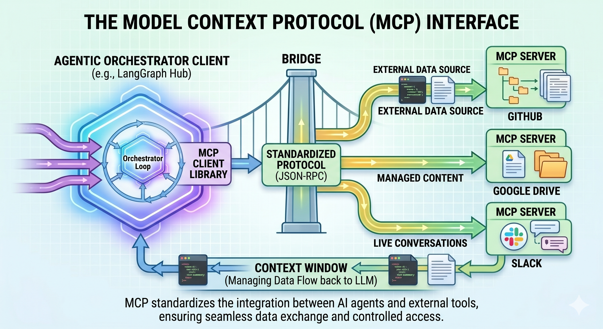

# MCP providers (shipped catalog)

The tool loads MCP **templates** from `agentic-orchestration-tool/config/mcp_providers/` (one `*.yaml` per integration unless using a legacy bundle file). Merge additional directories via `AGENTIC_EXTRA_MCP_PROVIDERS_PATH` (`;` on Windows, `:` on Unix).

## Design

Each file is a **single** mapping (not a list) with at least:

- **`id`** — Stable identifier referenced by the planner / plan JSON.
- **`description`** — What the server does in context (human + planner).
- **`planner_hint`** — When the planner should attach this MCP.
- **`capabilities`** — Tool surface / behavior at a glance (optional but recommended for shipped entries).
- **`good_for`** — Task patterns and pairing hints (optional).
- **`user_goal_keywords`** (optional) — Keyword hints for relevance / pruning.
- **`required_env`** / **`required_env_any`** (optional) — Credential or opt-in gating; entries are dropped if env is missing/empty.

Connection shapes:

- **`streamable_http`** — `url` and optional `headers`; `${VAR}` placeholders expand from the environment.
- **`stdio`** — `command`, `args`, optional `env` — local subprocess (e.g. `npx`, `python -m …`). Same expansion rules for args/env values.

Upstream protocol: [Model Context Protocol](https://modelcontextprotocol.io/).

## Curated MCP directory (community)

The **[awesome-mcp-servers](https://github.com/punkpeye/awesome-mcp-servers)** list groups thousands of third-party MCP implementations by category. It is a **discovery index**, not an endorsement list. Use it to find servers to run yourself, then wire them into this project via new YAML under `config/mcp_providers/` or `AGENTIC_EXTRA_MCP_PROVIDERS_PATH`.

### Mapping: this repo’s YAML ↔ awesome-mcp-servers

Related listings are **alternatives or complements** for the same *kind* of capability; they are **not** necessarily what this repo invokes by default.

| Catalog `id` | What we wire by default | Example related entries on [awesome-mcp-servers](https://github.com/punkpeye/awesome-mcp-servers) |
|--------------|-------------------------|---------------------------------------------------------------------------------------------------|
| `home_assistant` | Official [Home Assistant MCP](https://www.home-assistant.io/integrations/mcp_server/) — Streamable HTTP `/api/mcp`, bearer token. | [allenporter/mcp-server-home-assistant](https://github.com/allenporter/mcp-server-home-assistant), [tevonsb/homeassistant-mcp](https://github.com/tevonsb/homeassistant-mcp) |
| `search_brave` | Your Brave Search MCP **Streamable HTTP** URL (`BRAVE_SEARCH_MCP_URL`) + API key. | [brave/brave-search-mcp-server](https://github.com/brave/brave-search-mcp-server), [mikechao/brave-search-mcp](https://github.com/mikechao/brave-search-mcp) |
| `search_tavily` | Tavily **hosted** MCP URL (API key; default pattern in YAML). | [tavily-ai/tavily-mcp](https://github.com/tavily-ai/tavily-mcp), [Tomatio13/mcp-server-tavily](https://github.com/Tomatio13/mcp-server-tavily), [kshern/mcp-tavily](https://github.com/kshern/mcp-tavily) |
| `search_exa` | **Exa** via official npm server (`exa-mcp-server`) and `EXA_API_KEY`. | [exa-labs/exa-mcp-server](https://github.com/exa-labs/exa-mcp-server) (see also hosted `https://mcp.exa.ai/mcp` in their docs) |
| `fetch_url` | Official **fetch** server (`python -m mcp_server_fetch`); PyPI `mcp-server-fetch`. | [modelcontextprotocol/server-fetch](https://github.com/modelcontextprotocol/servers) — **Search & data extraction** |
| `memory_knowledge_graph` | Official **memory** server (`@modelcontextprotocol/server-memory`). | [modelcontextprotocol/server-memory](https://github.com/modelcontextprotocol/servers) — **Knowledge & Memory** |
| `filesystem_local` | Official **filesystem** server (`@modelcontextprotocol/server-filesystem`) + one allowed path. | [modelcontextprotocol/server-filesystem](https://github.com/modelcontextprotocol/servers) — **File Systems** |

## Inventory (repository)

| `id` | Transport | Purpose | Required environment / opt-in |
|------|-----------|---------|--------------------------------|
| `home_assistant` | `streamable_http` | HA entities/actions via official MCP integration. | `HOME_ASSISTANT_URL`, `HOME_ASSISTANT_TOKEN` |
| `search_brave` | `streamable_http` | Web search via your Brave-compatible MCP host. | `BRAVE_SEARCH_API_KEY` (+ `BRAVE_SEARCH_MCP_URL` per YAML) |
| `search_tavily` | `streamable_http` | Web search via Tavily-hosted MCP. | `TAVILY_API_KEY` |
| `search_exa` | `stdio` | Exa web + code-context search. | `EXA_API_KEY` |
| `fetch_url` | `stdio` | Fetch and normalize a **known** URL for the model. | `AGENTIC_MCP_FETCH_ENABLED` + `pip install mcp-server-fetch` |
| `memory_knowledge_graph` | `stdio` | In-process knowledge graph memory tools. | `AGENTIC_MCP_MEMORY_MCP_ENABLED` (+ `npx` / Node) |
| `filesystem_local` | `stdio` | Read/write under one allowed directory root. | `FILESYSTEM_MCP_ALLOWED_DIRECTORY` (absolute path) |

## Kubernetes compatibility (K0.6)

When `AGENTIC_EXECUTION_BACKEND=kubernetes`, worker pods cannot spawn local stdio MCP subprocesses unless a **sidecar** is configured (K4). Policy: [Kubernetes execution upgrade](Kubernetes-execution-upgrade/#mcp-compatibility-matrix-k8s-mode); code allowlist: `orchestration/k8s_mcp_compat.py`.

| `id` | K3 MVP (default) | Notes |
|------|------------------|-------|
| `search_brave` | ✅ | streamable_http |
| `search_tavily` | ✅ | streamable_http |
| `home_assistant` | ✅ | streamable_http |
| `search_exa` | ❌ | stdio — K4 sidecar |
| `fetch_url` | ❌ | stdio — K4 sidecar |
| `filesystem_local` | ❌ | stdio — K4 PVC + sidecar |
| `memory_knowledge_graph` | ❌ | stdio — K4 sidecar |

Planner catalog filtering for K8s mode is **K4.3**; until then, avoid stdio MCPs in dynamic plans when targeting the kubernetes backend.

### Notes per id

#### `home_assistant`

- **Docs:** [Home Assistant MCP Server](https://www.home-assistant.io/integrations/mcp_server/)
- **Auth:** `Authorization: Bearer ${HOME_ASSISTANT_TOKEN}`

#### `search_brave`

- Point `BRAVE_SEARCH_MCP_URL` at **your** Streamable HTTP endpoint (self-hosted or vendor).
- **Awesome:** [brave/brave-search-mcp-server](https://github.com/brave/brave-search-mcp-server), [mikechao/brave-search-mcp](https://github.com/mikechao/brave-search-mcp).

#### `search_tavily`

- Default URL pattern: [Tavily MCP guide](https://docs.tavily.com/guides/mcp)
- **Awesome:** [tavily-ai/tavily-mcp](https://github.com/tavily-ai/tavily-mcp), [Tomatio13/mcp-server-tavily](https://github.com/Tomatio13/mcp-server-tavily), [kshern/mcp-tavily](https://github.com/kshern/mcp-tavily).

#### `search_exa`

- **Docs / keys:** [Exa MCP](https://docs.exa.ai/reference/exa-mcp)
- Runs `npx -y exa-mcp-server` with `EXA_API_KEY` in the subprocess environment.

#### `fetch_url`

- Install: `pip install mcp-server-fetch` into the **same** Python environment as `main.py`.
- Set `AGENTIC_MCP_FETCH_ENABLED=1` so the catalog entry is not hidden by credential filtering.

#### `memory_knowledge_graph`

- Runs `npx -y @modelcontextprotocol/server-memory`. Set `AGENTIC_MCP_MEMORY_MCP_ENABLED=1` for opt-in.

#### `filesystem_local`

- Set `FILESYSTEM_MCP_ALLOWED_DIRECTORY` to an **absolute** path. The model’s file tools are scoped to that root only.

## Adding a new MCP

1. Create `config/mcp_providers/<id>.yaml` with a unique `id`.
2. Add `description`, `capabilities`, `good_for`, and `planner_hint` so planners and humans understand scope.
3. Set `required_env` / `required_env_any` so only runnable integrations appear when credentials are present.
4. Use **`streamable_http`** or **`stdio`** (not both in one file).
5. Find related community servers in [awesome-mcp-servers](https://github.com/punkpeye/awesome-mcp-servers) and document them here if the integration is non-obvious.

## Related pages

- [Dynamic planning](Dynamic-planning/) — when MCP sets appear in plans.
- [Configuration](Configuration/) — env vars summary.
- [Third party projects](Third-party-projects/) — upstream products and licenses.
- [awesome-mcp-servers](https://github.com/punkpeye/awesome-mcp-servers) — full community index.
