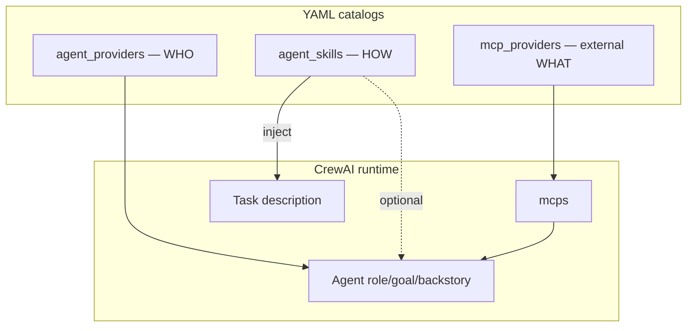

# Agent skills roadmap (procedural knowledge catalog)

Living document for adding **YAML-defined, agent-agnostic procedural skills** — release workflows, review checklists, domain playbooks, and similar **how-to** instructions — parallel to the existing [MCP providers]({{ '/mcp-catalog/' | relative_url }}) catalog.

**Status:** **Shipped (S1–S4)** — catalog loader, static/dynamic attachment, runner/materializer/worker injection, CLI, `release_process` / `pr_review` skills, smoke workflow (2026-06).

**Chosen approach:** Skills are a **third composable catalog** alongside agent providers and MCP (`config/agent_skills/`). Catalog entries supply markdown instructions injected into **task descriptions** (default) or optionally **agent backstory**. Skills do not add callable tools; they compose with MCP.

**Related:** [Architecture]({{ '/architecture/' | relative_url }}), [MCP providers]({{ '/mcp-catalog/' | relative_url }}), [Agent provider catalog]({{ '/agent-catalog/' | relative_url }}), [Dynamic planning]({{ '/dynamic-planning/' | relative_url }}), [Sessions learning and knowledge base]({{ '/sessions-learning-kb/' | relative_url }}), [Kubernetes execution upgrade]({{ '/kubernetes-execution-upgrade/' | relative_url }}), [Configuration]({{ '/configuration/' | relative_url }})

---

## Problem statement

Today procedural knowledge is scattered across mechanisms that do not support “declare a skill in YAML, attach it to a step, planner picks it dynamically”:

| Capability | Today | Gap |
|------------|-------|-----|
| Agent identity | `role`, `goal`, `backstory` on [Agent provider catalog]({{ '/agent-catalog/' | relative_url }}) entries | Fixed per provider template — not composable per step |
| Tool usage hints | `augment_backstory_for_mcp_tools()` when MCP is attached | Generic MCP argument shape only — not domain workflows |
| Step handoff | `step_context.py` injects prior step output | Runtime continuity, not curated procedures |
| Retrieval context | [Sessions learning and knowledge base]({{ '/sessions-learning-kb/' | relative_url }}) KB snippets in planner prompt | Fuzzy past-run excerpts — not versioned playbooks on agent tasks |
| Planner domain rules | Hardcoded blocks in `dynamic_planner.py` | Not catalog-driven or attachable per step |

[MCP providers]({{ '/mcp-catalog/' | relative_url }}) answers “wire an external tool.” This roadmap answers “wire **procedural instructions** any agent can follow on a given step.”

---

## Three catalogs, one attachment model

```
agentic-orchestration-tool/config/
├── agent_providers/    # WHO runs (LLM backend, role, goal)
├── agent_skills/       # Procedural skills — HOW ([Agent skills]({{ '/agent-skills/' | relative_url }}))
└── mcp_providers/      # EXTERNAL tools via MCP protocol
```

| Catalog | Runtime effect | Best for |
|---------|----------------|----------|
| `agent_providers` | CrewAI `Agent` identity | Model/backend selection, role semantics |
| `agent_skills` | Injected markdown into `Task.description` (or backstory) | Release process, PR review, schema-query playbooks |
| `mcp_providers` | External MCP server connections | Community servers, search APIs, filesystem, media, Home Assistant |

A single task can attach **skills + MCP ids** independently.



**Key rule:** YAML is catalog + metadata; long instruction bodies live in referenced markdown files (optionally Cursor-compatible `SKILL.md`). YAML never contains agent definitions.

---

## YAML schema (catalog entry)

One file per catalog entry under `config/agent_skills/` (mirrors MCP metadata fields):

```yaml
id: release_process
description: >-
  Cut a semver release: bump VERSION, update CHANGELOG, tag, push.
capabilities: Release workflow for this repo (RELEASING.md).
good_for: "cut a release", "publish v1.2.3", "tag and push"
planner_hint: >-
  Attach when the user asks to release, bump version, or publish a tag.
user_goal_keywords:
  - release
  - changelog
  - version bump
  - tag

required_env: []   # same credential / env gating pattern as MCP

content:
  file: instructions.md          # relative to this YAML file's directory
  # or inline for small skills:
  # body: |
  #   ## Release steps
  #   1. ...

inject:
  target: task_description         # task_description | backstory | both
  heading: "## Release process (skill)"
  max_chars: 12000                 # per-entry token budget guard
```

### Directory layout (optional, Cursor-compatible)

```
config/agent_skills/release_process/
├── release_process.yaml    # catalog entry (metadata + inject config)
└── instructions.md         # procedural body (or SKILL.md with YAML frontmatter)
```

Optional: accept `SKILL.md` with `name` / `description` frontmatter so skills can be shared between Cursor IDE (`.cursor/skills/`) and this orchestrator.

### Planned environment variables

| Variable | Purpose |
|----------|---------|
| `AGENTIC_EXTRA_AGENT_SKILLS_PATH` | Extra catalog directories (`;` on Windows, `:` on Unix) — same pattern as `AGENTIC_EXTRA_MCP_PROVIDERS_PATH` |
| `AGENTIC_AGENT_SKILLS_CATALOG` | Default catalog path override (CLI `--agent-skills-catalog` preferred) |
| `AGENTIC_SKILLS_MAX_CHARS_PER_TASK` | Global cap on injected skill text per task (default TBD) |

---

## Workflow and planner attachment

Semantics mirror `mcp_providers`: top-level default, per-step override, `[]` to force none.

### Static workflow YAML

```yaml
workflow:
  skills: []   # workflow default

  tasks:
    - id: ship_release
      agent_provider_id: gpt_write
      skills:
        - release_process
      mcp_providers:
        - filesystem_local
      description: "..."
      expected_output: "..."
```

### Dynamic planner JSON

```json
{
  "skill_ids": ["release_process"],
  "mcp_provider_ids": ["filesystem_local"],
  "steps": [
    {
      "agent_provider_id": "gpt_write",
      "skill_ids": ["release_process"],
      "description": "...",
      "expected_output": "..."
    }
  ]
}
```

---

## Core types and injection contract

### Injection targets

| Target | When to use | Cache impact |
|--------|-------------|--------------|
| `task_description` (default) | Step-specific procedures | None — skills resolved when building `Task` |
| `backstory` | Agent-wide standing rules | Shipped — extends agent cache key with backstory skill fingerprint |
| `both` | Step + standing overlay | Shipped — injects into task description and backstory |

Default injection point in `runner.py` when building CrewAI `Task` objects — parallel to `prepare_step_description()` in `step_context.py` for prior-step handoff.

Proposed helper (new module `orchestration/agent_skills_context.py`):

```python
def augment_description_for_skills(
    description: str,
    skill_blocks: Sequence[str],
    *,
    heading: str = "## Attached skills",
) -> str: ...
```

Optional `augment_backstory_for_skills()` / `resolve_agent_backstory()` in `agent_providers/base.py` — shipped; same chaining pattern as `augment_backstory_for_mcp_tools()`.

### `agent_skills_catalog.py` (new)

Mirror `mcp_providers_catalog.py`:

| Function | MCP analogue |
|----------|----------------|
| `load_agent_skills_catalog(path)` | `load_mcp_providers_catalog` |
| `load_agent_skills_catalog_merged(primary)` | `load_mcp_providers_catalog_merged` |
| `filter_skill_entries_by_credentials` | `filter_mcp_entries_by_api_credentials` |
| `resolve_workflow_skill_refs(raw_ids, catalog)` | `resolve_workflow_mcp_refs` |
| `skills_list_fingerprint(resolved)` | `mcps_list_fingerprint` |
| `skills_catalog_for_planner_prompt(entries)` | `mcp_catalog_for_planner_prompt` |
| `resolve_skill_content(entry) -> str` | *(new — load file or inline body)* |

---

## Implementation phases

### Phase 0 — Config surface (no behavior change)

| Task | Location |
|------|----------|
| `TaskDefinition.skills: list[str] \| None` | `orchestration/config_loader.py` |
| `WorkflowConfig.skills: list[str]` | `orchestration/config_loader.py` |
| `raw_skill_spec_for_task(task, config)` | `orchestration/config_loader.py` |

**Exit criteria:** existing workflows unaffected; new YAML fields parse correctly.

---

### Phase 1 — Catalog loader

**New file:** `orchestration/agent_skills_catalog.py`

**Exit criteria:** unit tests load YAML, resolve ids, filter credentials, load `content.file` / `content.body`.

---

### Phase 2 — Runner injection

**`orchestration/runner.py`:**

- `agent_skills_catalog_path: Path | None`
- Resolve per-task skill ids → load content → `augment_description_for_skills()` before `Task(...)`

**Exit criteria:** static workflow with `skills: [stub_skill]` changes task description seen by the agent.

---

### Phase 3 — Dynamic planner

**`orchestration/dynamic_planner.py`:**

1. Load skills catalog alongside MCP catalog.
2. Planner system prompt block via `skills_catalog_for_planner_prompt()`.
3. Parse `skill_ids` in plan JSON → `WorkflowConfig` / `TaskDefinition`.
4. Optional keyword relevance pruning (`_maybe_augment_skills_from_user_goal()` — copy MCP goal-matching patterns).
5. `learning_store.py`: `skill_fingerprint_from_ids()` parallel to MCP fingerprint.

**Exit criteria:** `--dynamic` attaches `release_process` when the user asks to cut a release.

---

### Phase 4 — Distributed execution (K8s / subprocess workers)

Workers carry **catalog ids** in `StepSpec`, not inlined markdown.

| Change | File |
|--------|------|
| `StepSpec.skills: list[str]` | `orchestration/backends/base.py` |
| `resolve_task_skill_maps()` | `orchestration/workflow_materializer.py` |
| Re-resolve content from spec + catalog | `orchestration/execute_step.py` |

**Exit criteria:** K8s/subprocess worker runs a step with an attached skill; injected text appears in step description.

---

### Phase 5 — CLI and configuration

**`main.py`:**

```text
--agent-skills-catalog   default: config/agent_skills
```

Thread `agent_skills_catalog_path` through every call site that already passes `mcp_catalog_path`.

Update [CLI reference]({{ '/cli-reference/' | relative_url }}) and [Configuration]({{ '/configuration/' | relative_url }}) when implemented.

---

### Phase 6 — Shipped skill examples

| Catalog `id` | Content source | Notes |
|--------------|----------------|-------|
| `release_process` | `RELEASING.md` excerpt or wrapper | Pairs with MCP `filesystem_local` for file edits |
| `pr_review` | Team PR checklist markdown | Composable with any `gpt_*` / `claude_*` writer |
| `echo_skill` | Inline `content.body` (3 lines) | Smoke test only |

**Exit criteria:** smoke workflow `workflow_agent_skills_smoke.yaml` shows injected skill text in verbose logs.

---

### Phase 7 — Tests

| Test file | Coverage |
|-----------|----------|
| `tests/test_agent_skills_catalog.py` | load, merge, env sub, credentials, resolve, fingerprint |
| `tests/test_agent_skills_runner.py` | `build_workflow` injects skills into task description |
| `tests/test_agent_skills_planner.py` | plan JSON → `skills` on tasks |
| `tests/test_agent_skills_materializer.py` | `StepSpec.skills` serialization |

---

## Delivery slices

| Slice | Phases | User-visible outcome |
|-------|--------|----------------------|
| **S1 — skeleton** | 0, 1, 2, 5 | Catalog loads; stub skill injects into static workflow |
| **S2 — dynamic** | 3 | Planner picks skills from catalog |
| **S3 — cluster** | 4 | K8s workers get skills |
| **S4 — real skills** | 6 | Release / PR review examples shipped |

---

## Key design decisions

1. **Skills inject context, not tools** — callable capabilities stay in [MCP providers]({{ '/mcp-catalog/' | relative_url }}); skills may *reference* those tools in prose.
2. **Default injection is task-level** — step-specific procedures without changing agent cache keys.
3. **Attachment semantics match MCP** — `workflow.skills`, `task.skills`, planner `skill_ids`, `[]` to force none.
4. **Token budget is explicit** — per-entry `inject.max_chars` plus global `AGENTIC_SKILLS_MAX_CHARS_PER_TASK`; optional `content.summary` for planner-only hints when bodies are large.
5. **Skills ≠ agent provider backstory** — provider hints describe *identity*; skills describe *procedures* composable across providers (`gpt_write` + `release_process`).
6. **Skills ≠ KB** — KB supplies fuzzy retrieved snippets to the planner; skills supply curated, versioned playbooks on agent task text.

---

## Out of scope for v1

- Inline skill bodies in workflow YAML (catalog ids only)
- Skills that execute code or spawn subprocesses (use MCP)
- Auto-discovery of markdown files without catalog YAML
- Skills replacing the dynamic planner system prompt

---

## Shipped capabilities (summary)

- YAML catalog under `config/agent_skills/` with credential and `required_files` gating
- Static workflow + dynamic planner attachment (`skills`, `skill_ids`)
- Task and backstory injection; combined MCP+skill learning fingerprints
- Subprocess/K8s worker re-resolve from `StepSpec.skills`
- Shipped skills: `echo_skill`, `release_process`, `pr_review`; smoke workflow `workflow_agent_skills_smoke.yaml`

---

## See also

- [Agent skills]({{ '/agent-skills/' | relative_url }}) — shipped catalog reference (inventory, env vars)
- [MCP providers]({{ '/mcp-catalog/' | relative_url }}) — external tool integrations
- [Sessions learning and knowledge base]({{ '/sessions-learning-kb/' | relative_url }}) — KB and learning (planner context, not per-task skills)
- [Agent provider catalog]({{ '/agent-catalog/' | relative_url }}) — agent identity templates
- [Dynamic planning]({{ '/dynamic-planning/' | relative_url }}) — planner JSON contract extended with `skill_ids`
