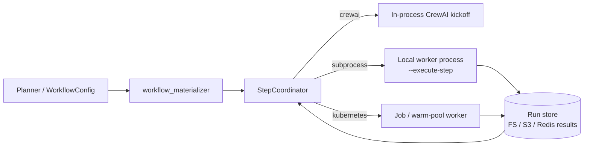

# Architecture

## High-level flow


1. **Planner** (dynamic modes) — Reads the user goal, session history, optional KB snippets, and learning summary; outputs a JSON plan: ordered steps with `agent_provider_id`, optional MCP ids, and optional skill ids (see [Agent skills roadmap]({{ '/agent-skills-roadmap/' | relative_url }})).
2. **Catalog resolution** — Agent templates load from `config/agent_providers/` (or extra paths). MCP templates load from `config/mcp_providers/` plus `AGENTIC_EXTRA_MCP_PROVIDERS_PATH`. Agent skills load from `config/agent_skills/` plus `AGENTIC_EXTRA_AGENT_SKILLS_PATH`. Entries without required credentials (or missing `required_files`) are filtered out before planning. Platform harness verification ([Agent harness roadmap]({{ '/Agent-harness-roadmap/' | relative_url }})) and user scenario packs ([User agent harnesses]({{ '/User-agent-harnesses/' | relative_url }})).
3. **Runner** — Selects execution backend (`AGENTIC_EXECUTION_BACKEND`, default in-process CrewAI). Builds CrewAI `Agent` / `Task` / `Crew` for in-process runs; distributed backends materialize `StepSpec` lists and coordinate per-step workers.
4. **Post-run** — Optional artifact extraction, verification, session JSON updates, learning traces, KB append, impartial QA (opt-in), web UI progress.

## Distributed execution backends

`AGENTIC_EXECUTION_BACKEND` chooses how each planned step runs. The planner, catalogs, and session/KB layers stay the same; only the step execution path changes.



| Backend | Where steps run | Specs | Results |
|---------|-----------------|-------|---------|
| `crewai` (default) | Same process as coordinator | N/A (whole-crew kickoff) | In-memory / session |
| `subprocess` | Child `python main.py --execute-step` | Local / `AGENTIC_RUN_STORE_PATH` | Same FS, or promote to S3/Redis |
| `kubernetes` | Worker Job or warm-pool pod | PVC / mounted path | PVC mirror + optional S3/Redis |

Shared pieces: `StepSpec` JSON, `execute_step.py`, `step_recovery.py` (HF / provider retry), `run_store_from_env()`. See [Dual execution framework]({{ '/dual-execution-framework/' | relative_url }}) and [Kubernetes execution upgrade]({{ '/kubernetes-execution-upgrade/' | relative_url }}).

## Packages

| Package | Role |
|---------|------|
| `agentic-orchestration-tool` | Python: YAML workflows, dynamic planner, MCP catalog, sessions, learning, KB, CLI (`main.py`). |
| `agentic-orchestration-web` | Node: HTTP + WebSocket server; spawns the tool for chat messages. |

## Configuration directories (tool)

```
agentic-orchestration-tool/config/
├── workflows/           # Static workflow YAML; routable files add top-level `meta`
├── agent_providers/    # One YAML per agent template (dynamic catalog)
├── agent_harnesses/    # Planned — platform smoke profiles ([Agent harness roadmap]({{ '/Agent-harness-roadmap/' | relative_url }}))
# User harness packs live outside core — AGENTIC_EXTRA_AGENT_HARNESS_DIRS ([User agent harnesses]({{ '/User-agent-harnesses/' | relative_url }}))
├── mcp_providers/      # One YAML per MCP template (streamable HTTP, stdio, refs, env gates)
└── agent_skills/       # One YAML per procedural skill ([Agent skills roadmap]({{ '/agent-skills-roadmap/' | relative_url }}))
```

## Orchestration modules (selected)

Under `agentic-orchestration-tool/orchestration/`:

- `backends/` — Pluggable execution (`crewai`, `subprocess`, `kubernetes`); factory reads `AGENTIC_EXECUTION_BACKEND`.
- `workflow_materializer.py` — `WorkflowConfig` → `StepSpec` for distributed backends.
- `step_coordinator.py` — Sequential step loop shared by subprocess/K8s backends.
- `run_store.py` / `run_store_backends.py` — Result handoff (`filesystem` default; optional `s3` / `redis`).
- `execute_step.py` — Worker entrypoint for `--execute-step`.
- `agent_harness.py` — Platform harness tiers — [Agent harness roadmap]({{ '/Agent-harness-roadmap/' | relative_url }}).
- `user_agent_harness.py` — User scenario packs (`--harness-dir`) — [User agent harnesses]({{ '/User-agent-harnesses/' | relative_url }}).
- `impartial_qa.py` — Opt-in unified deliverable gate (`AGENTIC_IMPARTIAL_QA`).
- `society_runtime.py` — Agent societies (`--society`) — [Agent societies roadmap]({{ '/Agent-societies-roadmap/' | relative_url }}).
- `runner.py` — Build workflow, crew lifecycle (in-process path).
- `dynamic_planner.py` — Planning, iterative rounds, controller, synthesis, eval hooks.
- `mcp_providers_catalog.py` — Load/merge MCP YAML, env substitution, credential filtering, planner hints; resolves `streamable_http` and `stdio` blocks into CrewAI MCP configs.
- `agent_skills_catalog.py` — Load/merge skill YAML, credential/`required_files` gating, task/backstory injection, planner hints, learning attachment fingerprints.
- `agent_skills_context.py` — Append skill markdown blocks to task descriptions and agent backstory.
- `orchestrator_session.py` — Session JSON under `__orchestrator_sessions__/`.
- `learning_store.py` — Traces, stats, pending ratings under `__orchestrator_learning__/`.
- `knowledge_base.py` — SQLite FTS under `__orchestrator_kb__/`.
- `catalog_loader.py` / `config_loader.py` — Workflow and provider discovery.

## Gitignored runtime paths

| Path | Content |
|------|---------|
| `__orchestrator_sessions__/` | Planner turns + excerpts per session slug. |
| `__orchestrator_learning__/` | `stats.json`, `traces.jsonl`, `pending_ratings.jsonl`. |
| `__orchestrator_kb__/` | `kb.sqlite3` (FTS index). |
| `__orchestrator_run_traces__/` | Per-run request traces (`{run_id}.jsonl`). |
| `__orchestrator_llm_usage__/` | Token usage ledger. |
| `__orchestrator_api_tokens__/` | Minted API tokens and app prefs. |
| `__orchestrator_mtls__/` | Local CA and client certs. |
| `__orchestrator_deals__/` | Deal membership. |
| `__output__/` | Extracted artifacts from runs. |
| `_web_uploads/` | Web upload scratch. |
| `harness_runs/` | Harness run JSON. |
| `.env` | Secrets — never commit. |

## Extension points

- **More agents:** add YAML under `config/agent_providers/` or `AGENTIC_EXTRA_AGENT_PROVIDERS_PATH` (Python provider classes).
- **More MCPs:** add YAML under `config/mcp_providers/` or `AGENTIC_EXTRA_MCP_PROVIDERS_PATH`. Discover third-party servers via [awesome-mcp-servers](https://github.com/punkpeye/awesome-mcp-servers) (see [MCP providers]({{ '/mcp-catalog/' | relative_url }}) for shipped examples). File, media, vision, and generation capabilities are covered by MCP integrations (e.g. `filesystem_local`, community image/video servers).
- **Agent skills:** YAML catalog under `config/agent_skills/` — see [Agent skills]({{ '/agent-skills/' | relative_url }}).
- **Custom workflows:** add files under `config/workflows/`; optional `meta` for router inclusion.

See also: [System architecture]({{ '/system-architecture/' | relative_url }}) (deployed Kubernetes / edge k3s component map), [Agent provider catalog]({{ '/agent-catalog/' | relative_url }}), [MCP providers]({{ '/mcp-catalog/' | relative_url }}), [Agent skills]({{ '/agent-skills/' | relative_url }}), [Agent skills roadmap]({{ '/agent-skills-roadmap/' | relative_url }}), [Configuration]({{ '/configuration/' | relative_url }}), [Infrastructure]({{ '/infrastructure/' | relative_url }}) (Docker Compose, Ollama sidecar, volumes), [Dual execution framework]({{ '/dual-execution-framework/' | relative_url }}) (pluggable execution backends — F0–F3 shipped), [Kubernetes execution upgrade]({{ '/kubernetes-execution-upgrade/' | relative_url }}) (cluster delivery — K3+ pending).
