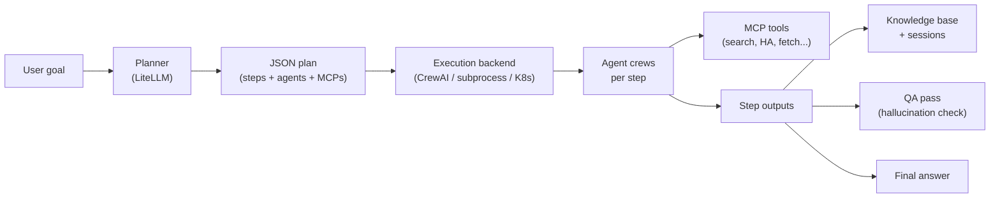

## System flow



## Components

### Planner

Reads the user goal, session history, knowledge-base snippets, and learning summary. Outputs a structured JSON plan: steps, agent provider IDs, MCP IDs, and task descriptions. Runs via LiteLLM (`AGENTIC_PLANNER_MODEL`).

### Catalog resolution

- **Agent providers** filtered by credentials, hardware (`architecture`, `min_vram_gb`), and optional domain-aware suppression of general-purpose entries.
- **MCP providers** filtered by `required_env` / `required_env_any` gates.

### Runner

`ExecutionBackend` factory selects how each step runs:

| Backend | Implementation |
|---|---|
| `inprocess` | `CrewAIExecutionBackend` — default, zero extra setup |
| `subprocess` | Spawns `python main.py --execute-step` workers |
| `kubernetes` | Creates a K8s Job per step with shared PVC run store |

### Post-run pipeline

1. Update orchestrator session JSON
2. Append to knowledge base (if enabled)
3. Record learning trace (if enabled)
4. Final faithfulness QA (if enabled)
5. Extract and optionally verify saved artifacts

## Repository layout

```
agentic-orchestration/
├── agentic-orchestration-tool/
│   ├── config/
│   │   ├── agent_providers/   # one YAML per agent template
│   │   ├── mcp_providers/     # one YAML per MCP integration
│   │   └── workflows/         # static workflow YAML
│   ├── orchestration/         # planner, runner, backends, sessions, KB
│   └── main.py
├── agentic-orchestration-web/ # Node.js WebSocket UI
└── examples/verticals/        # domain overlays (healthcare, logistics)
```

## Execution backend comparison

| Backend | Isolation | Shared state | Best for |
|---|---|---|---|
| In-process | None | In-memory | Local dev, fastest iteration |
| Subprocess | Process per step | `AGENTIC_RUN_STORE_PATH` | Step isolation, container smoke tests |
| Kubernetes | Pod per step | PVC at `AGENTIC_K8S_RUN_STORE_MOUNT` | Production, horizontal scale |

See [Execution Backends](/execution-backends/) for configuration.
