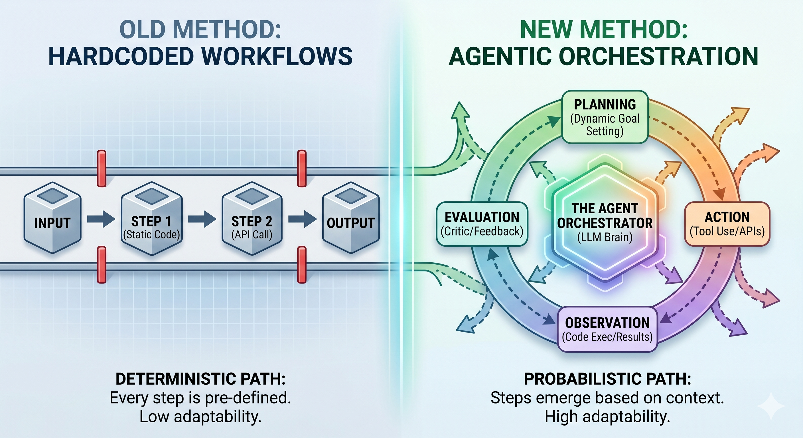

# Agentic Orchestration

Documentation for the **agentic-orchestration** monorepo: a YAML-driven, model-agnostic **CrewAI** orchestration layer with optional **MCP** tools, dynamic planning, browser UI, sessions, learning, and a local knowledge base.

## Who this is for

- Teams who want to **wire existing models, MCP servers, and APIs** into multi-step agent workflows **without** writing a new orchestration framework.
- Developers evaluating **proof-of-concept** setups using **catalogs** (`config/agent_providers/`, `config/mcp_providers/`) and **environment variables**.

## Documentation map

| Topic | Page |
|--------|------|
| Repository layout, components, data directories | [Architecture](Architecture/) |
| Docker Compose, optional Ollama, volumes / networking | [Infrastructure](Infrastructure/) |
| Dual execution framework (CrewAI + pluggable backends) | [Dual execution framework](Dual-execution-framework/) |
| K8s execution upgrade roadmap (pod-per-step, phased) | [Kubernetes execution upgrade](Kubernetes-execution-upgrade/) |
| Full list of shipped **agent provider** YAML templates | [Agent provider catalog](Agent-provider-catalog/) |
| Shipped **MCP** catalog (HA, search, Exa, fetch, memory, filesystem, …) | [MCP providers](MCP-providers/) |
| Static workflows, router mode, `meta` blocks | [Workflows and router](Workflows-and-router/) |
| `--dynamic`, `--dynamic-iterative`, planner, controller | [Dynamic planning](Dynamic-planning/) |
| Sessions, learning loop, KB, answer cache | [Sessions learning and knowledge base](Sessions-learning-and-knowledge-base/) |
| Environment variables (authoritative: `.env.example`) | [Configuration](Configuration/) |
| Unit tests, GitHub Actions CI, test tiers | [Testing and CI](Testing-and-CI/) |
| Versioning, changelog, GitHub Releases | [Releases](Releases/) |
| WebSocket UI, `AGENTIC_*` web env, scripts | [Web UI](Web-UI/) |
| CLI flags and modes | [CLI reference](CLI-reference/) |
| Dependencies, upstream projects, licenses | [Third party projects](Third-party-projects/) |
| How to publish the docs site on **GitHub Pages** | [GitHub Pages publish](GitHub-Pages-publish/) |

## Recent project updates reflected here

- Dynamic runs now support file attachments via manifest (`--dynamic-attachments`), including web upload flow.
- Dynamic planner can be constrained to selected provider IDs (`--dynamic-agent-provider-ids`).
- Iterative mode supports optional per-round stdout streaming (`AGENTIC_DYNAMIC_ITER_STREAM_STEPS`).
- Web UI improved markdown rendering pipeline and exposes process health metadata (`/api/ping`).
- `--example healthcare|logistics` overlay flow is now documented in CLI references.

## Example vertical visuals

Healthcare vertical:

Logistics vertical:

## Source of truth in Git

The canonical codebase paths are:

- **Tool:** `agentic-orchestration-tool/` (`main.py`, `orchestration/`, `config/`)
- **Web:** `agentic-orchestration-web/`
- **Root:** `README.md`, `LICENSE`, `NOTICE`, `THIRD_PARTY_NOTICES.md`

When the documentation and repository diverge, prefer the **repository** for filenames, line-accurate behavior, and the latest YAML.

## Quick links (in the main repository)

- Root: `README.md`
- Tool: `agentic-orchestration-tool/README.md`
- Web: `agentic-orchestration-web/README.md`
- Environment template: `agentic-orchestration-tool/.env.example`
- Third-party list: `THIRD_PARTY_NOTICES.md`
- Community MCP index: [awesome-mcp-servers](https://github.com/punkpeye/awesome-mcp-servers) — see [MCP providers](MCP-providers/) for how our YAML maps to example entries there.
