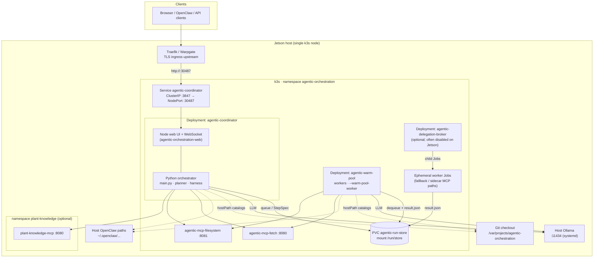
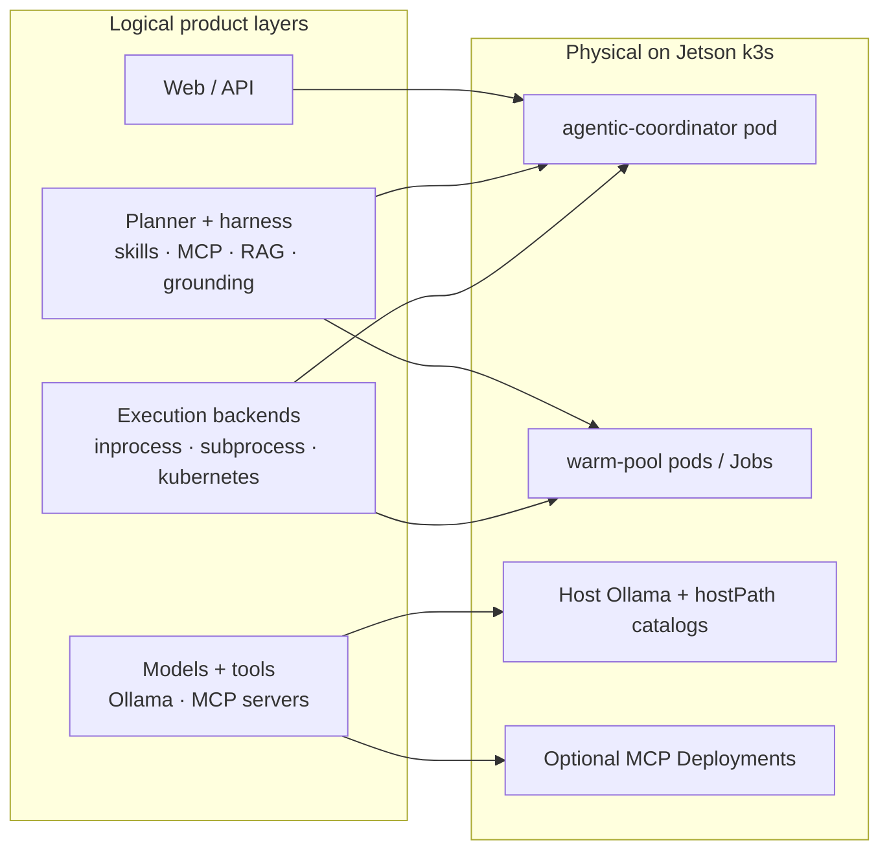

# System architecture (Kubernetes / Jetson)

This page is the **deployed system** view — runtime components, networks, and storage — similar to an AWS/Azure landing-zone diagram. It complements the conceptual product flow on [Architecture]({{ '/architecture/' | relative_url }}).

**Primary reference deployment:** NVIDIA Jetson AGX Orin running **k3s**, namespace `agentic-orchestration`, repo at `/var/projects/agentic-orchestration`.

## Component map (edge)



## Request path (control + data)

```mermaid
sequenceDiagram
  actor User
  participant Edge as Traefik / Warpgate
  participant Coord as agentic-coordinator
  participant Plan as Planner harness
  participant Store as run-store PVC
  participant Worker as warm-pool / Job
  participant LLM as Host Ollama
  participant Tools as MCP / RAG / skills

  User->>Edge: HTTPS chat / API
  Edge->>Coord: NodePort 30487 → :3847
  Coord->>Plan: dynamic plan (rag_ids, mcp, skills)
  Plan->>Coord: WorkflowConfig / StepSpec[]
  Coord->>Store: enqueue step specs
  Worker->>Store: claim step
  Worker->>Tools: inject RAG / skills; call MCP tools
  Worker->>LLM: agent completion
  LLM-->>Worker: model output
  Worker->>Store: result.json (+ rag_audit)
  Coord->>Store: read results / progress
  Coord-->>User: WebSocket / HTTP reply
```

## What runs where

| Component | Role | Typical image / process |
|-----------|------|-------------------------|
| **agentic-coordinator** | Web UI + planner + step dispatch (`AGENTIC_EXECUTION_BACKEND=kubernetes`) | `ghcr.io/.../agentic-orchestrator-coordinator` |
| **agentic-warm-pool** | Pre-warmed workers executing steps from the PVC queue | `ghcr.io/.../agentic-orchestrator-worker` |
| **agentic-delegation-broker** | Spawns child Jobs for `k8s_delegate_task` (often **off** on Jetson) | worker image entrypoint `--delegation-broker` |
| **Host Ollama** | Local LLMs for planner + agents | Host binary, not an in-cluster pod |
| **run-store PVC** | Shared step handoff `{run_id}/{step_id}/result.json` | hostPath or RWX volume at `/run/store` |
| **MCP gateways** | Optional shared fetch / filesystem MCP over HTTP | in-cluster Deployments |
| **RAG / skills / MCP YAML** | Catalogs — **not** separate pods | hostPath from git (and OpenClaw dirs) |

**RAG** is harness code inside the coordinator and workers (inject / `rag_query` / citation gate). There is no RAG microservice pod.

## Catalogs and host mounts (Jetson)

Git-synced files on the device are bind-mounted into pods so catalog updates do not require image rebuilds:

| Catalog | Host path (under repo unless noted) | Coordinator mount | Warm-pool mount |
|---------|--------------------------------------|-------------------|-----------------|
| RAG sources | `.../config/rag_sources` | `/app/tool/config/rag_sources` | `/app/config/rag_sources` |
| Agent skills (Jetson extras) | `.../config/agent_skills_jetson` | `/app/tool/config/agent_skills_jetson` | `/app/config/agent_skills_jetson` |
| MCP providers | `.../config/mcp_providers` | `/app/tool/config/mcp_providers` | `/app/config/mcp_providers` |
| MCP server packages | `.../mcp_servers` | `/app/tool/mcp_servers` | `/app/mcp_servers` |
| OpenClaw MCP | `~/.openclaw/agentic-orchestration/openclaw-mcp-providers` | `/openclaw/mcp-providers` | same |
| OpenClaw workspace | `~/.openclaw/workspace` | host path in pod | same |

Hotfix ConfigMaps also overlay selected Python modules onto coordinator/worker images (see `scripts/jetson-hotfix-web.sh`).

## Logical layers vs physical pods



Use this when explaining to stakeholders: **one edge node**, **few Deployments**, **shared PVC**, **host LLM**, **catalogs as volumes** — not one pod per agent or per RAG corpus.

## Related

- [Architecture]({{ '/architecture/' | relative_url }}) — conceptual product flow
- [Infrastructure]({{ '/infrastructure/' | relative_url }}) — deploy modes, GHCR, Jetson scripts
- [Kubernetes execution upgrade]({{ '/kubernetes-execution-upgrade/' | relative_url }}) — warm pool / Jobs roadmap detail
- [Dual execution framework]({{ '/dual-execution-framework/' | relative_url }}) — backend code seams
- [Web UI]({{ '/web-ui/' | relative_url }}) — Warpgate session headers
- Operator manifests: `agentic-orchestration-tool/deploy/k8s/`
